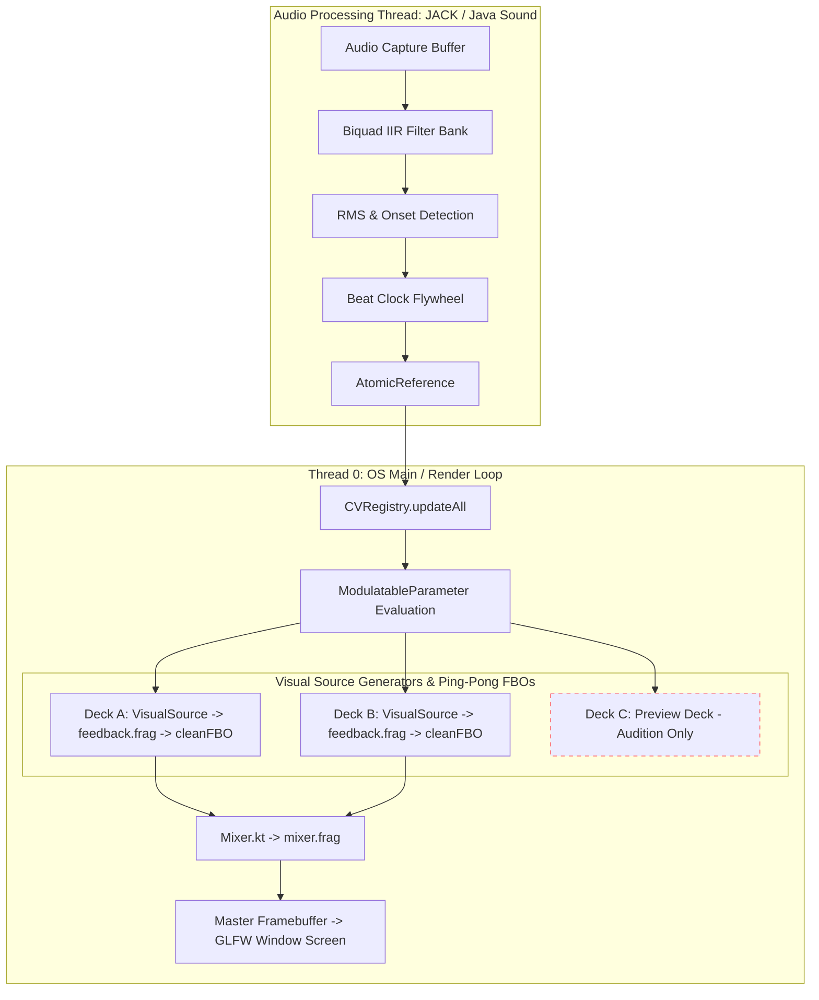

# Architecture Overview

This section covers high-level system design, threading boundaries, concurrency models, and notes persistence in **Liquid LSD**.

---

## High-Level Video & Data Pipeline

---

## Threading Boundaries

Liquid LSD runs across two core thread contexts: **Thread 0 (OS Main / Render Thread)** and the **Audio Capture Thread**.

### 1. Thread 0 (OS Main & Rendering Thread)
- **Responsibilities**: GLFW event polling, OpenGL context management, framebuffer allocation, GLSL shader compilation/binding, frame rendering (Decks A/B/C, Mixer), and ImGui UI rendering.
- **Strict Constraint**: All LWJGL 3 GLFW window and OpenGL context manipulations must execute strictly on Thread 0.

### 2. Audio Thread (JACK Callback / Java Sound Daemon Loop)
- **Responsibilities**: Receives incoming audio sample buffers, executes parallel biquad IIR bandpass filtering (Bass, Mid, High), computes RMS amplitude, calculates spectral flux onset triggers, and updates beat clock state.
- **Strict Real-Time Constraints**:
  - **Zero-Allocation Rule**: No heap allocations (`new`, capturing closures, collection instantiations) inside the audio callback loop.
  - **Non-Blocking Rule**: No mutex locks, file I/O, database access, logging, or thread sleeping.

---

## Concurrency Safety & Lock-Free Data Passing

Because the audio processing loop runs at sub-millisecond hardware intervals (~50–200 Hz) while Thread 0 renders frames at screen refresh rates (60Hz–144Hz+), lock-free synchronization prevents audio dropouts (xruns) and frame stuttering.

### Concurrency Primitives
- **`AtomicReference<BeatAnchor>`**: Lock-free swap mechanism passing `totalBeats`, estimated `bpm`, and `nanoTime` from the audio thread to `CVRegistry`. Thread 0 reads this reference without locks and interpolates sub-millisecond phase accuracy.
- **`CvHistoryBuffer`**: Pre-allocated ring buffer storing 200 CV samples for lock-free oscilloscope drawing in `CellConfigPanel`.
- **`@Volatile` Flags**: Thread-safe single-scalar flags (`isBpmLocked`, `manualBpm`, `inputGain`) accessed across threads without lock overhead.
- **Concurrent Queues**: `ConcurrentLinkedQueue` handles pending patch loading DTOs (`PatchManager`) and incoming MIDI CC events (`MidiEngine`).

---

## Notes System Persistence Architecture

Liquid LSD integrates a three-tier notes persistence model managed by `NotesManager.kt`:

| Note Scope | Storage Target | Lifetime | API Method |
|------------|----------------|----------|------------|
| **Global Source Notes** | `~/.liquid-lsd/source-notes.json` | App-global; survives patch changes | `NotesManager.getSourceNote / setSourceNote` |
| **Patch Notes** | `.lsdpatch` JSON (`patchNotes`) | Saved/loaded per patch file | `NotesManager.getPatchNote / setPatchNote` |
| **Parameter Notes** | `.lsdpatch` JSON (`paramNotes`) | Saved/loaded per patch file | `NotesManager.getParamNote / setParamNote` |

`PatchManager` automatically syncs in-memory notes with `.lsdpatch` DTOs during async load (`syncFromDto`) and save (`syncToDto`) operations.
