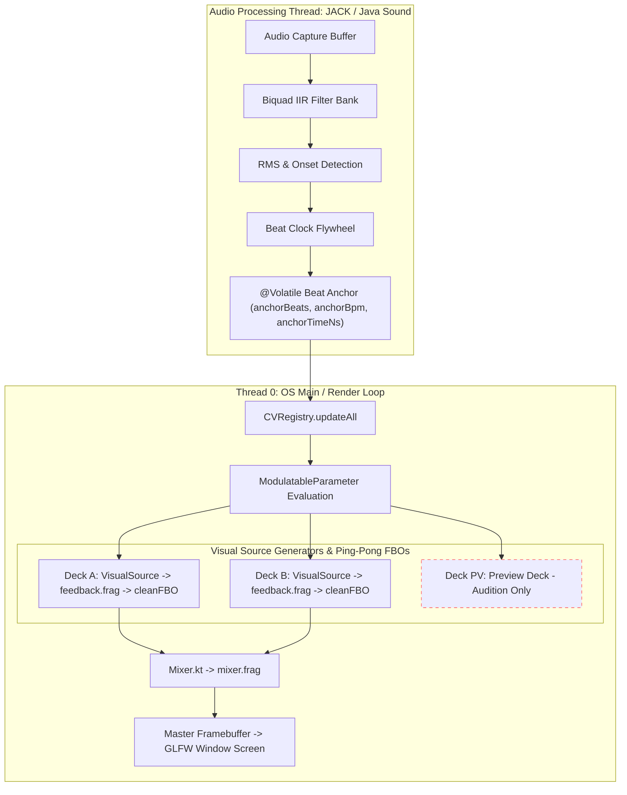

# Architecture Overview

This section covers high-level system design, threading boundaries, concurrency models, and notes persistence in **Liquid LSD**.

---

## High-Level Video & Data Pipeline

---

## Threading Boundaries

Liquid LSD runs across two core thread contexts: **Thread 0 (OS Main / Render Thread)** and the **Audio Capture Thread**.

### 1. Thread 0 (OS Main & Rendering Thread)
- **Responsibilities**: GLFW event polling, OpenGL context management, framebuffer allocation, GLSL shader compilation/binding, frame rendering (Decks A/B/C, Mixer), and ImGui UI rendering.
- **Strict Constraint**: All LWJGL 3 GLFW window and OpenGL context manipulations must execute strictly on Thread 0.

### 2. Audio Thread (JACK Callback / Java Sound Daemon Loop)
- **Responsibilities**: Receives incoming audio sample buffers, executes parallel biquad IIR bandpass filtering (Bass, Mid, High), computes RMS amplitude, calculates spectral flux onset triggers, and updates beat clock state.
- **Strict Real-Time Constraints**:
  - **Zero-Allocation Rule**: No heap allocations (`new`, capturing closures, collection instantiations) inside the audio callback loop.
  - **Non-Blocking Rule**: No mutex locks, file I/O, database access, logging, or thread sleeping.

---

## Concurrency Safety & Lock-Free Data Passing

Because the audio processing loop runs at sub-millisecond hardware intervals (~50–200 Hz) while Thread 0 renders frames at screen refresh rates (60Hz–144Hz+), lock-free synchronization prevents audio dropouts (xruns) and frame stuttering.

### Concurrency Primitives
- **`@Volatile` Beat Anchor Fields**: Lock-free update passing `anchorBeats`, `anchorBpm`, and `anchorTimeNs` directly from the audio thread to `CVRegistry.updateBeatAnchor()` using primitive `@Volatile` fields. Zero object allocations occur on the audio callback thread. Thread 0 reads these volatile variables without locks and interpolates sub-millisecond phase accuracy via `CVRegistry.getSynchronizedTotalBeats()`.
- **`CvHistoryBuffer`**: Pre-allocated ring buffer storing 200 CV samples for lock-free oscilloscope drawing in `CellConfigPanel`.
- **`@Volatile` Flags**: Thread-safe single-scalar flags (`isBpmLocked`, `manualBpm`, `inputGain`) accessed across threads without lock overhead.
- **Concurrent Queues**: `ConcurrentLinkedQueue` handles pending preset loading DTOs (`PresetManager`) and incoming MIDI CC events (`MidiEngine`).

---

## Notes System Persistence Architecture

Liquid LSD integrates a three-tier notes persistence model managed by `NotesManager.kt`:

| Note Scope | Storage Target | Lifetime | API Method |
|------------|----------------|----------|------------|
| **Global Source Notes** | `~/.liquid-lsd/source-notes.json` | App-global; survives preset changes | `NotesManager.getSourceNote / setSourceNote` |
| **Preset Notes** | `.lsd` JSON (`presetNotes`) | Saved/loaded per preset file | `NotesManager.getPresetNote / setPresetNote` |
| **Parameter Notes** | `.lsd` JSON (`paramNotes`) | Saved/loaded per preset file | `NotesManager.getParamNote / setParamNote` |

`PresetManager` automatically syncs in-memory notes with `.lsd` DTOs during async load (`syncFromDto`) and save (`syncToDto`) operations.

---

## Video I/O & External GPU Texture Streaming Architecture

Liquid LSD provides low-latency, zero-copy (or DMA-BUF/MemFD) live video sharing to external VJ software (Resolume Arena, OBS Studio, TouchDesigner, MadMapper):

- **Platform Drivers**:
  - **Windows**: Spout2 sender/receiver via native `SpoutLibrary.dll` JNA bindings. Reusable buffer pools prevent per-frame byte/int array allocations, and sender name strings are clamped to 255 bytes.
  - **macOS**: Syphon client/server via Objective-C runtime JNA bridge (`Syphon.framework`). Named `NSSize`/`NSRect` structures use 64-bit `Double` coordinates for ARM64/Apple Silicon LP64 ABI compliance with pre-allocated size query buffers.
  - **Linux**: PipeWire 0.3 video bridge.

### PipeWire Thread Decoupling & Lock-Free Frame Handoff
To maintain the project's strict real-time constraint preventing `pw_thread_loop_lock` or socket blocking on Thread 0:
- **Output Path (`PipeWireBridge`)**: Thread 0 deposits a newly rendered `ByteBuffer` into `pendingFrame` (`AtomicReference<ByteBuffer?>`) via `publishFrameBuffer()`. An asynchronous background worker (`Dispatchers.IO`) polls at up to 120Hz and drains the frame into PipeWire via `drainPendingFrame()`, copying pixels into the resolved `spa_buffer` memory without ever acquiring locks on the GL thread.
- **Ingest Path (`PipeWireReceiverImpl`)**: Buffers dequeued from `pw_stream_dequeue_buffer()` are processed using a reusable `SpaData` instance (`bindMemory(datasPtr)`), and pixel data is uploaded to OpenGL using direct native memory addresses (`Pointer.nativeValue(dataPtr)`), completely eliminating per-frame wrapper heap allocations on Thread 0.
