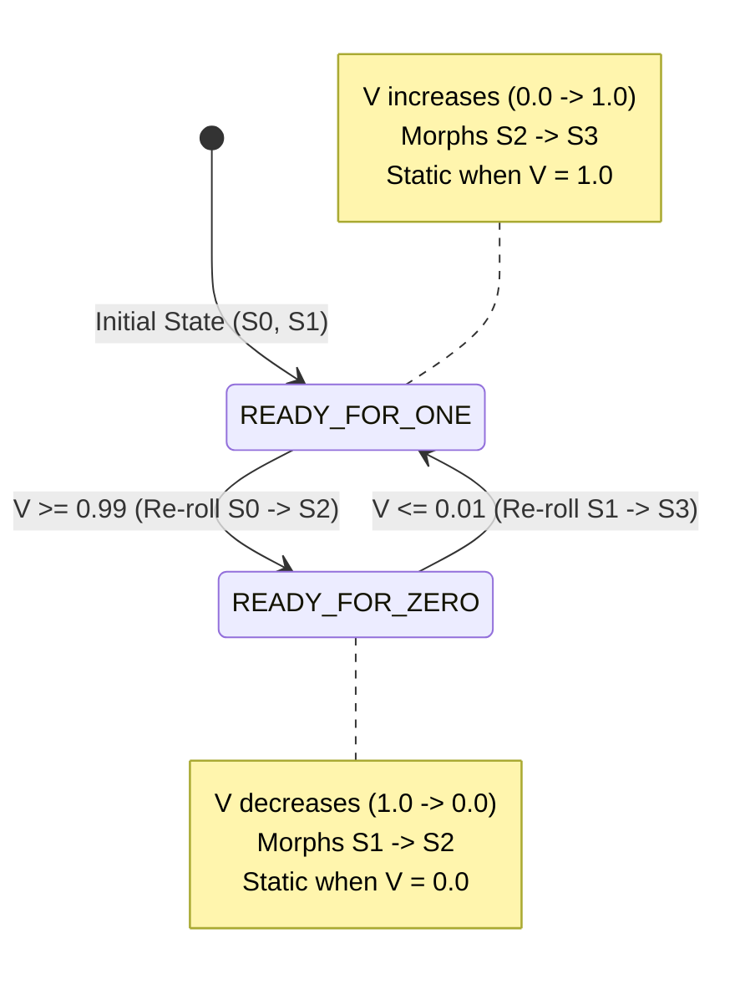

# Proposal: Continuous Constrained Random Morphing

**Status**: Draft / RFC  
**Target Area**: `rendering/Mixer.kt`, `rendering/Deck.kt`, `parameters/ModulatableParameter.kt`, `ui/PresetGridPanel.kt`, `ui/MixerMonitorPanel.kt`  
**Authors**: GJ & Antigravity  

---

## 1. Overview & Motivation

Liquid LSD currently features **constrained randomization** across all visual sources and feedback loops: parameters and modulators can have bounded random ranges defined in presets. 

Currently, triggering randomization via the Mixer (`randDeckA`, `randDeckB`, `randDeckBG`, `randDeckPV`, `randAll`) operates as a **discrete, 1-shot trigger**: when a button is clicked or a CV signal crosses a $0.5$ threshold, parameters instantly jump to new randomized values.

### The Vision
Transform the existing randomization knobs from instantaneous step triggers into **continuous morphing controllers ($0.0 \leftrightarrow 1.0$)**. 

By letting a normalized float value $V \in [0.0, 1.0]$ control the interpolation between two randomized states ($S_0$ and $S_1$), we unlock **generative, evolving visual journeys** without adding new UI controls. Standard LFOs, envelopes, CV sources, or manual MIDI faders can drive continuous transitions with customizable morphing, holding, and cycling speeds.

---

## 2. Core Concepts & State Machine

### 2.1 Two-State Interpolation Model
For each controllable scope (Deck A, Deck B, Deck BG, Deck PV, or All), the engine maintains two state snapshots:
* **State $S_0$**: The snapshot of parameter base values and active modulator properties mapped to $V = 0.0$.
* **State $S_1$**: The snapshot of parameter base values and active modulator properties mapped to $V = 1.0$.

When the parameter value is $V$, active parameters are rendered using:
$$\text{ActiveParameter}(V) = \text{lerp}(S_0, S_1, V)$$

```
  V = 0.0                   V = 0.5                   V = 1.0
 [State S0] ──────────────► [50% S0 + 50% S1] ──────────────► [State S1]
 (Boundary 0)                                            (Boundary 1)
```

---

### 2.2 Ping-Pong Boundary Triggers (The Flip-Flop Latch)

To allow unending, non-repeating morphs as an oscillator sweeps back and forth, hitting a boundary rolls the *opposite* state:

1. **State Machine State**: `TargetBoundary` $\in \{\text{READY\_FOR\_ONE}, \text{READY\_FOR\_ZERO}\}$.
2. **Ascending ($0.0 \to 1.0$)**:
   * Value moves from $0 \to 1$, blending from $S_0 \to S_1$.
   * When $V \ge 1.0 - \epsilon$ (e.g. $0.99$):
     * The latch transitions to `READY_FOR_ZERO`.
     * State $S_0$ is **re-rolled** using constrained randomization to become fresh target $S_2$.
     * As long as $V$ remains high (held at $1.0$), the output remains static at $S_1$.
3. **Descending ($1.0 \to 0.0$)**:
   * As soon as $V$ decreases below $1.0 - \epsilon$, the deck begins morphing from $S_1 \to S_2$.
   * When $V \le \epsilon$ (e.g. $0.01$):
     * The latch transitions to `READY_FOR_ONE`.
     * State $S_1$ is **re-rolled** to become fresh target $S_3$.
     * While $V$ remains at $0.0$, the output remains static at $S_2$.



---

## 3. Waveform Behaviors

Because Liquid LSD's modulation engine already provides rich waveforms with `subdivision`, `morph`, `hold`, and tempo sync, driving `randDeckA` with different modulators naturally produces diverse behaviors:

### A. LFO with Hold (The "Morph & Hold" Goal)
* **Waveform**: `RANDOM` or `TRIANGLE` with `modulator.hold = 0.5`.
* **Behavior**:
  1. $V$ ramps $0 \to 1$ over 1 minute (Morphing $S_0 \to S_1$).
  2. $V$ holds at $1.0$ for 1 minute (Static at $S_1$).
  3. $V$ ramps $1 \to 0$ over 1 minute (Morphing $S_1 \to S_2$).
  4. $V$ holds at $0.0$ for 1 minute (Static at $S_2$).
* **Result**: Perfectly achieves interval + morph + hold with zero custom timing code!

### B. Triangle / Sine Wave (Continuous Seamless Evolution)
* **Waveform**: `TRIANGLE` with `hold = 0.0`.
* **Behavior**: Continually sweeps between new random states without resting. Every half-cycle delivers an evolving generative visual sequence.

### C. Square Wave (Instant Jump Cuts)
* **Waveform**: `SQUARE`.
* **Behavior**: Instantly alternates between $0.0$ and $1.0$, producing instantaneous jumps to new random states at exact rhythmic intervals (identical to the current trigger behavior).

### D. Sawtooth Up (Build & Drop)
* **Waveform**: `SAWTOOTH` (Ramp Up).
* **Behavior**: Slowly morphs towards the new state across the bar, then on the drop instantly resets and jumps to a fresh state to begin the next build.

### E. Attenuated / Partial Range ($0.2 \leftrightarrow 0.8$)
* **Behavior**: Never crosses the $\epsilon$ boundary thresholds, so $S_0$ and $S_1$ are never re-rolled. It smoothly crossfades back and forth between the *same two presets*, functioning as an expressive A/B macro.

---

## 4. Edge Cases & Safeguards

| Scenario / Edge Case | Potential Problem | Solution / Design Rule |
| :--- | :--- | :--- |
| **Boundary Noise / Jitter** | An analog CV or noisy LFO near $1.0$ ($0.999 \to 1.0 \to 0.999$) could trigger dozens of re-rolls per second. | **Flip-Flop Hysteresis**: Once $V \ge 0.99$, latch requires $V \le 0.01$ before any subsequent re-roll can occur. |
| **Mid-Morph Direction Reversal** | User/LFO reverses direction at $V = 0.6$. | Interpolator reverses smoothly back towards the source state. No pops or discontinuities. |
| **Endless Parameters (Angles & Hues)** | Linear interpolation of angles ($-\pi \to \pi$) or hues ($0 \to 1$) could spin the long way around. | Use shortest-path modular interpolation for `MeterType.ENDLESS` and `explicitIsAngle` parameters. |
| **Manual UI Button Press** | User clicks `[Rand A]` button in UI. | Instantly generate a new $S_0$ / $S_1$ target pair and trigger an immediate refresh or cycle step. |
| **Physical MIDI Fader Mapping** | DJ assigns MIDI CC fader to `Mixer/randDeckA`. | Pushing the fader up morphs to state $S_1$; pulling it down morphs to a brand new state $S_2$. Gives infinite manual tactile morphing. |

---

## 5. Architectural & Implementation Blueprint

### 5.1 Parameter State Snapshot (`DeckRandomState`)
A lightweight data structure capturing the randomizable state of a deck:
```kotlin
data class ParameterStateSnapshot(
    var baseValue: Float,
    val modulators: MutableList<CvModulatorSnapshot>
)

data class CvModulatorSnapshot(
    var depth: Float,
    var subdivision: Double,
    var phaseOffset: Double,
    var slope: Float,
    var morph: Float,
    var hold: Float,
    var dcOffset: Float
)
```

### 5.2 Interpolation Function in `Deck.kt`
```kotlin
fun applyInterpolatedState(s0: DeckRandomState, s1: DeckRandomState, t: Float) {
    // 1. Lerp base values
    // 2. Lerp modulator depths, subdivisions, offsets
    // 3. Evaluate active parameters
}
```

### 5.3 Low-Latency / Zero-Allocation Guarantee
* Pre-allocate snapshot buffers for $S_0$ and $S_1$ per deck during initialization.
* Re-rolling modifies the pre-allocated snapshot in place.
* Zero garbage collection overhead during per-frame lerping.

---

## 6. Summary of Benefits

1. **Zero UI Explosion**: Reuses `randDeckA`, `randDeckB`, `randDeckBG`, `randDeckPV`, `randAll` directly.
2. **Maximum Expressivity**: Leverages all existing LFO waveforms, beat sync, audio envelope followers, and MIDI control.
3. **Smooth & Discontinuity-Free**: No abrupt parameter jumps unless explicitly desired (via square/saw waves).
