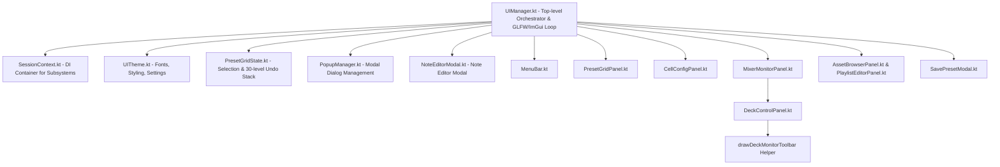

# UI Architecture & ImGui Systems

The `ui/` package manages the immediate-mode desktop interface using ImGui (`imgui-java`), LWJGL 3, and GLFW. This document maps component ownership, memory safety patterns, popup scheduling, and the `NoteEditorModal` architecture.

---

## Component Dependency Graph

All panel `draw(...)` methods receive `session: SessionContext`, the current `Mixer` reference, and `presetState: PresetGridState` at frame render time. Panels access subsystems (`AudioEngine`, `CVRegistry`, `PresetManager`, `PlayQueueManager`, `NotesManager`) via `session` rather than direct global singletons.

Deck preview monitors (`Deck A`, `Deck B`, `Deck C`) in `MixerMonitorPanel` and `DeckControlPanel` use a unified interactive preset bar (`drawDeckMonitorToolbar`) positioned directly **above** each monitor image. The preset bar orders elements left-to-right as `[Save Button] [Eject Button] [Preset Bar]`. Buttons and the Preset Bar are aligned along their bottom baselines, and the row height dynamically expands as text font scaling increases.

`MixerMonitorLayoutCalculator` calculates exact 16:9 aspect preview sizes against available pane height and comprehensive vertical chrome (master controls, preset bars, separator bands, and safety margins). It utilizes the full pane width without reserving unconditional scrollbars, automatically scaling monitor previews to fit vertically without scrolling on standard screens, and displaying scrollbars only on extremely small display heights.

---

## Key Core UI Orchestrators

### 1. `UIManager.kt`
- **Main Loop Integration**: Invoked once per frame (`render(mixer, width, height)`). Initialises and disposes `ImGuiImplGlfw` and `ImGuiImplGl3`.
- **Workspace Layout & Auto-Sizing Splitters**: Orchestrates the three-column desktop workspace. Left Panel (`PresetGridPanel`) width auto-fits active CV columns, label widths, and font zoom (`CTRL-`/`CTRL=`). Splitter 1 is a static visual divider that repositions automatically, while Splitter 2 is interactive to resize Middle (`CellConfigPanel`) vs Right (`MixerMonitorPanel`).
- **Deferred Font Atlas Rebuilding**: Changing font size sets `pendingFontSize`. Rebuilding font atlas and OpenGL textures occurs at the **top of the next frame** (before `ImGui.newFrame()`) to prevent mid-frame atlas corruption.
- **Deferred Popup Triggering**: Modal popups set a `pendingOpen*` flag and execute `ImGui.openPopup(id)` at the root ID stack level outside child windows.
- **Modal Rendering Pipeline**: Invokes `NoteEditorModal.draw()` and `PopupManager.draw()` at root scope.

### 2. `NoteEditorModal.kt`
- **Role**: Stateful singleton modal editor for the 3-tier Note System.
- **`NoteContext` Sealed Class**:
  - `Param(deckLabel, paramKey, displayLabel)`: Edits parameter-level notes.
  - `Source(sourceId, displayName)`: Edits global visual source notes.
  - `Preset(deckLabel, presetName)`: Edits preset-level notes.
- **Zero-Allocation Buffer Safety**: Allocates a single `ImString(2048)` buffer at object instantiation (`textBuffer`). Calling `NoteEditorModal.request(context)` populates `textBuffer` with the current note text. Drawing `ImGui.inputTextMultiline` reuses this pre-allocated buffer every frame without heap allocation.

### 3. `UITheme.kt`
- Manages font rendering (Inter, JetBrains Mono, Lucide icons merged via `setMergeMode(true)`).
- **Critical Font Array Ownership**: Font `ByteArray` fields (`regularBytes`, `boldBytes`) and `iconRange: ShortArray` are stored as class fields. Calling `setFontDataOwnedByAtlas(false)` prevents native ImGui from attempting to free JVM-managed byte arrays.

---

## ImGui Native Memory & Allocation Rules

Because ImGui uses JNI wrappers around native C++ pointers, strict memory rules must be followed across all `ui/` files to prevent JVM SegFaults and Garbage Collection pauses:

| Wrapper Type | Instantiation Rule | Cleanup Rule |
|--------------|-------------------|--------------|
| **`ImString`** | Allocate as **class/field-level variable**. Never allocate locally inside `draw()`. | Reused frame-to-frame. |
| **`ImBoolean` / `ImInt`** | Class field if state persists; local variables allowed only in rare modal popups. | Reused frame-to-frame. |
| **`ImGuiStyle`** | Class/singleton instance. | Must call `.destroy()` in `dispose()`. |
| **`ImFontConfig`** | Instantiated per font build. | Must call `.destroy()` immediately after loading. |

---

## Pattern for Adding a New UI Panel

1. **Pre-allocate String Buffers**: Define all `ImString` fields at the class/object level (e.g. `val searchBuffer = ImString(256)`).
2. **Inject Context at Draw Time**: Accept `session: SessionContext`, `mixer: Mixer`, and `presetState: PresetGridState` in the `draw(...)` signature.
3. **Use Deferred Root Popups**: To open a popup, set a `pendingOpen` flag and call `ImGui.openPopup(id)` at the root ID level.
4. **Register in `UIManager`**: Hook panel rendering into `UIManager.render()`.
