# UI Architecture & ImGui Systems

The `ui/` package manages the immediate-mode desktop interface using ImGui (`imgui-java`), LWJGL 3, and GLFW. This document maps component ownership, memory safety patterns, popup scheduling, and the `NoteEditorModal` architecture.

---

## Component Dependency Graph

```mermaid
graph TD
    UIManager[UIManager.kt - Top-level Orchestrator & GLFW/ImGui Loop]
    
    SessionContext[SessionContext.kt - DI Container for Subsystems]
    UITheme[UITheme.kt - Fonts, Styling, Settings]
    PresetGridState[PresetGridState.kt - Selection & 30-level Undo Stack]
    PopupManager[PopupManager.kt - Modal Dialog Management]
    DeckPresetController[DeckPresetController.kt - Deck Presets & File Dialogs]
    WindowFrameController[WindowFrameController.kt - CSD Dragging & Edge Resizing]
    NoteEditorModal[NoteEditorModal.kt - Note Editor Modal]
    
    UIManager --> SessionContext
    UIManager --> UITheme
    UIManager --> PresetGridState
    UIManager --> PopupManager
    UIManager --> DeckPresetController
    UIManager --> WindowFrameController
    UIManager --> NoteEditorModal
    
    UIManager --> MenuBar[MenuBar.kt]
    UIManager --> PresetGridPanel[PresetGridPanel.kt]
    UIManager --> CellConfigPanel[CellConfigPanel.kt]
    UIManager --> MixerMonitorPanel[MixerMonitorPanel.kt]
    UIManager --> LibraryPanel[LibraryPanel.kt & PlaylistEditorPanel.kt]

    CellConfigPanel --> AudioModulatorSection[AudioModulatorSection.kt - Audio Followers & Controls]
    CellConfigPanel --> TriggerModulatorSection[TriggerModulatorSection.kt - Trigger Impulse Controls]
    CellConfigPanel --> MidiModulatorSection[MidiModulatorSection.kt - MIDI CC Modulator Controls]
    CellConfigPanel --> Lfo1Section[Lfo1Section.kt - LFO 1 / Generator Shaping]
    CellConfigPanel --> Lfo2Section[Lfo2Section.kt - LFO 2 Secondary Modulator]
    
    MixerMonitorPanel --> DeckControlPanel[DeckControlPanel.kt]
    DeckControlPanel --> drawDeckMonitorToolbar[drawDeckMonitorToolbar Helper]
    UIManager --> SavePresetModal[SavePresetModal.kt]
```



Most panel `draw(...)` methods (like `PresetGridPanel`) receive `session: SessionContext`, the current `Mixer` reference, and `presetState: PresetGridState` at frame render time. Other panels like `MixerMonitorPanel` and `DeckControlPanel` receive state via dependency injection in their constructors. Panels access subsystems (`AudioEngine`, `CVRegistry`, `PresetManager`, `PlayQueueManager`, `NotesManager`) via `session` rather than direct global singletons.

Deck preview monitors (`Deck A`, `Deck B`, `Deck BG`, `Deck PV`) in `MixerMonitorPanel` and `DeckControlPanel` use a unified interactive preset bar (`drawDeckMonitorToolbar`) positioned directly **above** each monitor image. The preset bar orders elements left-to-right as `[Save Button] [Eject Button] [Preset Bar]`. Buttons and the Preset Bar are aligned along their bottom baselines, and the row height dynamically expands as text font scaling increases.

`MixerMonitorPanel` features the master output monitor and a dedicated `MasterControls` child container consisting of the redesigned master `crossfade` slider flanked by interactive `[ A ]` and `[ B ]` boxed badges (with faint vertical tick marks at ends, midway points, and center, styled identically to `CustomRangeSlider`), and a row of momentary randomization buttons (`Rand A`, `Rand B`, `Rand BG`, `Rand PV`, `Rand All`) when randomization is enabled. Momentary triggers act as discrete pulses without initiating manual takeover or muting modulators. Clicking the `[ A ]` or `[ B ]` boxes immediately snaps the crossfader to Deck A (-1.0) or Deck B (+1.0) with manual takeover.

Left-clicking the main output monitor immediately focuses the Preset Grid to the `MIX` tab (`activeTopTab = "Mixer"`). Left-clicking any deck preview monitor (`Deck A`, `Deck B`, `Deck BG`, or `Deck PV`) immediately focuses the Preset Grid to that deck (`activeTopTab`). Dragging from a deck monitor initiates deck copy, move, or swap routing, and dropping preset files directly onto a monitor loads the preset into the corresponding deck.

`MixerMonitorLayoutCalculator` calculates exact aspect preview sizes against available pane height and comprehensive vertical chrome (master controls, preset bars, separator bands, and safety margins). It utilizes the full pane width without reserving unconditional scrollbars, automatically scaling monitor previews to fit vertically without scrolling on standard screens, and displaying scrollbars only on extremely small display heights. It also calculates the exact maximum allowed window width (`calculateMaxAllowedWindowWidth`) to lock the Mixer / Monitor panel to its ideal aspect-ratio width, preventing wasted letterbox blank space and ensuring the flexible center column (`CellConfigPanel` / `LibraryPanel`) absorbs all remaining display space.

---

## Key Core UI Orchestrators

### 1. `UIManager.kt` & Global Hotkey Routing (`Main.kt`)
- **Main Loop Integration**: Invoked once per frame (`render(mixer, width, height)`). Initialises and disposes `ImGuiImplGlfw` and `ImGuiImplGl3`. Zeroes `io.mouseWheelH` per frame to globally disable unintended horizontal scroll wheel panning from trackpads or trackpoints.
- **Global Key Routing (`Main.kt` & `UIManager.kt`)**: Chained GLFW key callback intercepts `F` (clean mode toggle), `B` (background video toggle), and `Ctrl-`/`Ctrl=` (Library preset name font scaling) whenever `!io.wantTextInput` or when clean mode is enabled. Spacebar cycles Library view (`HIDE` $\leftrightarrow$ `HALF` $\leftrightarrow$ `FULL`) when not typing.
- **Workspace Layout Orchestration**: Coordinates the three-column desktop workspace with mathematically locked left/right ends (Preset Grid fitted to active columns, Mixer Monitor fitted to aspect preview height) and a flexible middle column (Cell Config & Library). Outer panels strictly enforce `ImGuiWindowFlags.NoScrollbar` with exact inner column width calculation to prevent layout drifting. Vertical positioning below the top title bar uses `titleBarH + TITLE_BAR_PANEL_GAP` (`1.0f`), preserving an exact 1 px visual divider without hardcoded minimum bounds.
- **Title Bar Drag-to-Resize**: Supports vertical resizing of the docked Library by click-dragging empty areas of the Library menu bar.
- **Deferred Font Atlas Rebuilding**: Adjusting preset name scale sets `pendingFontRebuild`. Rebuilding the font atlas and OpenGL textures occurs at the **top of the next frame** (before `ImGui.newFrame()`) to prevent mid-frame atlas corruption.
- **Deferred Popup Triggering**: Modal popups set a `pendingOpen*` flag and execute `ImGui.openPopup(id)` at the root ID stack level outside child windows.
- **Modal Rendering Pipeline**: Invokes `NoteEditorModal.draw()`, `SavePresetModal.draw()`, and `PopupManager`'s specific draw methods (e.g. `drawExitPopup()`, `drawDeckConfirmPopups()`, `drawSourceChangeConfirmPopup()`, `drawMidiWarningPopup()`) at root scope.

### 2. `UIThemeStyler.kt`, `ColorTunerPanel.kt` & `SplitterManager.kt`
- **`UIThemeStyler.kt`**: Applies ImGui color palettes across all themes (`BORING`, `DARK_SOLARIZED`, `LIGHT_SOLARIZED`, `DARK_LUNARIZED`, `LIGHT_LUNARIZED`, `NEON`), manages window transparency/alpha blending when background video is enabled, renders multi-color Neon gradient backgrounds, and handles proportional `ImGuiStyle` styling.
- **`ColorTunerPanel.kt`**: Interactive developer tool window accessible via the "Color" top menu item. Provides real-time swatch assignment to all 17 themed ImGui elements without background dimming, enabling live dial-in across all palettes with instant clipboard Kotlin code generation.
- **`SplitterManager.kt`**: Manages mouse hit-testing, resize cursors (`ResizeEW` / `ResizeNS`), double-click reset positions, and draw-list divider rendering for vertical and horizontal layout splitters.

### 3. `DeckPresetController.kt` & `PresetGridKeyboard.kt`
- **`DeckPresetController.kt` Role**: Dedicated orchestrator for deck preset lifecycle, modal save/load/eject workflows, and file dialogs.
- **Deck Actions**: Coordinates move/copy/swap deck utilities with dirty-state checks, quick save vs "Save As" flow (`SavePresetModal`), duplicate copy naming (`_copy`), and ejecting with Auto-VJ dirty behavior resolution.
- **`PresetGridKeyboard.kt` Keyboard Shortcuts**: Intercepts keyboard navigation and editing commands within the Preset Grid:
  - `Ctrl+S` / `Cmd+S`: Saves the active deck preset directly if named, or opens the Save As modal if untitled. Ignored when focused on the Mixer or an empty deck.
  - `Shift+Ctrl+S` / `Shift+Cmd+S`: Opens the Save Preset As dialog for the active deck with auto-populated tags and duplicate name recommendation (`_copy`). Ignored when focused on the Mixer or an empty deck.
  - `Ctrl+Z` / `Cmd+Z`: Parameter and modulator undo.
  - `Ctrl+C` / `Ctrl+V`: Copy and paste of cell modulators or entire parameter rows.
  - `Delete` / `Backspace`: Resets active parameter or removes cell modulators.
- **Safe Visual Source Switching (`changeVisualSourceSafely`)**: Prompts user confirmation if changing visual sources when an active preset is loaded or dirty, resets active preset and cached DTO associations, clears stale selections in `PresetGridState`, updates sub-tabs, and pushes an undo snapshot.
- **ImGui File Browsers**: Manages independent `ImGuiFileBrowser` dialogs for Deck A and Deck B and executes asynchronous disk I/O via `PresetManager`.

### 4. `NoteEditorModal.kt`
- **Role**: Stateful singleton modal editor for the 3-tier Note System.
- **`NoteContext` Sealed Class**:
  - `Param(deckLabel, paramKey, displayLabel)`: Edits parameter-level notes.
  - `Source(sourceId, displayName)`: Edits global visual source notes.
  - `Preset(deckLabel, presetName)`: Edits preset-level notes.
- **Zero-Allocation Buffer Safety**: Allocates a single `ImString(2048)` buffer at object instantiation (`textBuffer`). Calling `NoteEditorModal.request(context)` populates `textBuffer` with the current note text. Drawing `ImGui.inputTextMultiline` reuses this pre-allocated buffer every frame without heap allocation.

### 5. `UITheme.kt`
- **Fixed 95% Typography Hierarchy**: Core semantic font levels are permanently locked to 95% scaling (Caption: 12px, Body: 14px, Code: 14px, H3: 15px, H2: 18px, H1: 22px, baseSize: 14.25px). Fonts include Inter, JetBrains Mono, and Lucide icons merged via `setMergeMode(true)`.
- **Dedicated Library Preset Name Sizing (`FontLevel.PRESET_NAME`)**: Presets in the Library list, Playlists, and Play Queues are rendered via `FontLevel.PRESET_NAME`, which scales between 80% and 120% of standard body size (11.2px–16.8px) in 10% increments without affecting performance controls or deck headers. 10% steps ensure distinct, pixel-aligned font rasterization without glyph bounding box collisions.
- **Proportional Icon Glyph Offset**: Lucide icons are configured with a scaled `setGlyphOffset(0f, round(size * 0.18f))` to ensure optical vertical centering and prevent icon bounding boxes from touching the top edge of buttons across all font sizes.
- **Critical Font Array Ownership**: Font `ByteArray` fields (`regularBytes`, `boldBytes`) and `iconRange: ShortArray` are stored as class fields. Calling `setFontDataOwnedByAtlas(false)` prevents native ImGui from attempting to free JVM-managed byte arrays.

### 6. Custom Sliders (`CustomRangeSlider.kt` & `BeatDivisionSlider.kt`)
- Compute row height (`h`), label positions (`labelY`), widget rows (`row2Y`), and center line (`centerY`) using calibrated typography metrics (`captionHeight`, `getFrameHeight()`) to ensure the "Current:" label and slider tracks never overlap adjacent rows or widgets.

### 6a. `CvModulatorSliderHelpers.kt` — Randomizable Slider Callback Bundle

Every `drawCustomRangeSlider` call operating on a `CvModulator` field requires three structurally identical callbacks: `onRandomizableChanged`, `onRangeChanged`, and `onValueChanged`. The helper function `cvModulatorSlider(...)` generates all three from a minimal description of which field is being bound:

```kotlin
val depthCbs = cvModulatorSlider(
    existing = existing,
    getValue = { depth }, getMin = { depthMin }, getMax = { depthMax },
    minLimit = 0f, maxLimit = 1f,
    copyWithRandomize = { enabled, nMin, nMax -> copy(randomizeDepth = enabled, depthMin = nMin, depthMax = nMax) },
    copyWithRange   = { sMin, sMax, v -> copy(depthMin = sMin, depthMax = sMax, depth = v) },
    copyWithValue   = { v -> copy(depth = v, depthMin = v, depthMax = v) },
    randomizeNow    = { randomizeDepth() },
    onReplace = onReplace,
)
// Pass callbacks directly into drawCustomRangeSlider named arguments:
//   onRandomizableChanged = depthCbs.onRandomizableChanged
//   onRandomizeNow        = depthCbs.onRandomizeNow
//   onRangeChanged        = depthCbs.onRangeChanged
//   onValueChanged        = depthCbs.onValueChanged
```

**Standard expansion logic** (`defaultOffset = 0.1f`): when enabling randomization and the range is currently collapsed (min == max), the range expands by `±defaultOffset`, clamped to `[minLimit, maxLimit]`. Sliders with non-standard expansion (e.g. beat subdivision uses index stepping, period/frame use multiplicative halving/doubling) keep their `onRandomizableChanged` inline and use the helper only for `onRangeChanged` / `onValueChanged`.

**Files using this helper:** `Lfo1Section`, `Lfo2Section`, `AudioModulatorSection`, `MidiModulatorSection`.


### 7. `SettingsPanel.kt` & `AudioEnginePanel.kt`
- **Settings Category Routing**: `SettingsPanel` organizes application preferences into 7 clean categories (`GENERAL`, `APPEARANCE`, `VIDEO_DISPLAY`, `AUDIO_ENGINE`, `SHADER_LOCATIONS`, `BROADCAST`, `SHORTCUTS`) and supports targeted opening via `SettingsPanel.open(category)`. The `APPEARANCE` category displays an informational typography hierarchy and the "Preset Name Size" slider (80%–120%).
- **Unified Modulator Control**: Enabling an engine subsystem (`audioEngineEnabled`, `midiEnabled`, `sequencerEnabled`) automatically determines column visibility in the Preset Grid and Cell Config panel. The Preset Grid header kebab menu (`⋮`) acts as a quick-switchboard to toggle these subsystems directly without modal navigation.
- **Audio Engine Tab & Oscilloscopes (`AudioEnginePanel.kt`)**: The audio subsystem UI is encapsulated within `AudioEnginePanel.kt` and drawn in a balanced two-column layout:
  - **Left Column**: Backend, input hardware device, channel routing dropdowns positioned inline on the same line as their text labels; Input Gain and System Volume sliders located below Channel Routing; Input Peak Meter, sync state, and beat synchronization / detection controls (manual BPM locking, Beat Tracker target band, detection presets, dual-headed BPM range slider). Colored backend status ("Jack active", "Java Sound Active", or "Audio Inactive") is displayed inline to the right of the "Enable Audio Engine" checkbox.
  - **Right Column**: Raw Audio Buffer oscilloscope and all sound-derived Control Voltage (CV) oscilloscopes stacked vertically.
  - MIDI controller detection status readout is located under Settings > General inline to the right of the "Enable MIDI" checkbox.
- **Audio Engine Quick Access**: Clicking the real-time BPM or DSP latency metric in the top performance stats bar (or opening `File > Settings... > Audio Engine`) navigates directly to the `AUDIO_ENGINE` category.
- **Title Bar & Menu Bar Architecture (`MenuBar.kt`)**: The main menu bar consolidates application actions into clean top-level menus:
  - `File`: Preset creation (`New Preset`), `Settings...`, and `Exit`.
  - `Output`: `Secondary Output Window`, `Record Master Output (REC)`, `Web Broadcast`, and `Export Video (Offline Studio)...`.
  - `Help`: `Documentation` and `Show Tooltips` toggle.
  - Contextual HUD status badges for recording (`REC mm:ss`, dropped frames counter) and Web Broadcast (`LIVE`, `CONNECTING`, `LIVE ERR`) appear dynamically on the title bar only when active.

### 8. `LibraryPanel.kt` & `BrowserActionToolbar.kt`
- **Sticky Column Headers**: The 4 Library columns (Presets, Playlist Editor, Play Queue, Background Queue) use outer child containers configured with `ImGuiWindowFlags.NoScrollbar or ImGuiWindowFlags.NoScrollWithMouse`. The top two rows of each column (header title + action buttons, followed by the filter/combo/control bar) remain pinned and sticky, while their items scroll independently in dedicated inner child windows (`##presets_scroll`, `##playlist_items_scroll`, `##queue_items_scroll`, `##bg_queue_items_scroll`).
- **Proportional Action Buttons & Balanced Padding (`BrowserActionToolbar.kt`, `LibraryPanel.kt`)**: Action buttons (Quick Audition Lock, Deck Load A/B/BG/PV, and Queue Q/BGQ) and window controls use a compact height of ~22 px (`btnH = 22f * fontScale`) with width dynamically calculated as ~1.5x button height (`calculateButtonWidth(btnH)`). Library title bar vertical frame padding is scaled to 6.0 px (`libTitleBarH = 32f`), preserving the ~2.5 px bottom margin while adding sufficient top clearance to prevent button borders from clipping against the horizontal splitter line.
- **Accurate Lucide PUA Mappings**: Audition latch toggle uses standard Lucide padlock codepoints (`Icons.LOCK = "\ue10b"`, `Icons.UNLOCK = "\ue10c"`).

### 9. Tooltip Subsystem & Ergonomic Positioning (`TooltipHelper.kt`)
- **Ergonomic Design Rationale**: Dear ImGui's built-in `setTooltip` positions popups strictly to the bottom-right of the mouse pointer (`mouse.x + 16, mouse.y + 10`), routinely obscuring parameter readouts, sliders, and adjacent matrix cells. In addition, Dear ImGui 1.86.12 lacks native hover delay flags (`ImGuiHoveredFlags.DelayNormal` was introduced in 1.88+). `TooltipHelper.kt` provides an ergonomic, zero-allocation tooltip positioning and delay subsystem.
- **Pure Geometric Quadrant Engine (`calculateTooltipPos`)**:
  - Calculates tooltip placement relative to a fixed $16 \times 22\,\text{px}$ cursor bounding box with a $4\,\text{px}$ vertical gap and $8\,\text{px}$ viewport margin.
  - **Beneath Pointer**: By default, places the tooltip below the cursor box (`targetY = mouseY + CURSOR_HEIGHT + CURSOR_GAP`) with its left edge aligned with the cursor's left edge (`targetX = mouseX`, `pivotX = 0.0f`).
  - **Right-Edge Alignment**: If the tooltip width overflows the right viewport edge (`mouseX + tipW > viewX + viewW - MARGIN`), it anchors to the cursor's right edge (`targetX = mouseX + CURSOR_WIDTH`, `pivotX = 1.0f`), extending cleanly to the left.
  - **Bottom-Edge Overflow Flip**: If the tooltip overflows the viewport bottom (`targetY + tipH > viewY + viewH - MARGIN`), it flips above the cursor box (`targetY = mouseY - CURSOR_GAP`, `pivotY = 1.0f`).
  - **Viewport Edge Clamping**: Clamps final window coordinates within viewport bounds `[viewX + MARGIN, viewX + viewW - MARGIN]`.
- **`ImGuiCond.Always` — Required to Override Dear ImGui's Internal Positioning**:
  - `prepareTooltipPos` uses `ImGuiCond.Always`. Dear ImGui's own `BeginTooltip()` internally calls `setNextWindowPos(mouse + offset, Always)` — any weaker condition such as `Appearing` is silently overridden, causing all tooltips to land at roughly the cursor hotspot position from frame 2 onward.
  - `Always` ensures our `setNextWindowPos` fires last, wins, and places tooltips at the computed quadrant position every frame.
- **Direct Top-Left Window Positioning with Zero ImGui Pivot**:
  - `prepareTooltipPos` converts the geometric result `(targetX, targetY, pivotX, pivotY)` directly into top-left window coordinates: `finalX = targetX - contentWidth * pivotX`, `finalY = targetY - contentHeight * pivotY` (clamped within display bounds), passing `(finalX, finalY)` to `setNextWindowPos` with a zero pivot `(0.0f, 0.0f)`.
  - In Dear ImGui, passing a non-zero pivot (e.g. `1.0f`) causes `SetNextWindowPos` to evaluate `pos -= window->SizeFull * pivot`. On frame 1 of a newly appearing tooltip, `window->SizeFull` is uninitialized `(0, 0)`, so ImGui applies a zero offset on frame 1 and only shifts the window on frame 2 when `SizeFull` is calculated. Pre-computing the top-left coordinate with zero pivot completely eliminates this frame-1 uninitialized size offset jump.
- **8-Slot Circular Size Cache**:
  - Custom tooltips cache their rendered width and height across frames in an 8-slot circular ring buffer. Hovering across rows in PresetGrid or switching between deck tooltips retains recent dimensions, guaranteeing immediate accurate quadrant placement without cache churn.
- **`ImGuiCol.Text` and `ImGuiCol.Border` Theme Isolation**:
  - All tooltip helpers push `ImGuiCol.Text` and `ImGuiCol.Border` using `TooltipHelper.baseTextColor` and `TooltipHelper.baseBorderColor` before `beginTooltip()`. This prevents styling state from calling widgets (such as `BrowserDeckButtons.push()`, which colors text and borders with deck accents) from bleeding into the tooltip window and its border.
  - `UIThemeStyler.setupThemeColors()` sets both base colors whenever the theme is applied or switched.

- **Zero-Allocation Hover Delay Tracker (`shouldShowTooltip`)**:
  - Tracks hover state without runtime heap allocations using a spatial hash key combining item bounding rect and content: `(minX.toInt() shl 16) xor minY.toInt() xor text.hashCode()`.
  - Compares `ImGui.getFrameCount()` against `lastHoveredFrame` to detect cursor departures or transitions between adjacent widgets.
  - Suppresses rendering until the cursor hovers continuously for $250\,\text{ms}$ (`DEFAULT_HOVER_DELAY_MS`), preventing distracting visual flashing during mouse sweeps across sliders, buttons, and grid cells.
- **Standardized UI Integration API**:
  - `itemTooltip(text: String, delayMs: Long = 250L)`: Replaces the verbose boilerplate pattern `if (isItemHovered() && tooltipsEnabled) ImGui.setTooltip(text)` across all UI panels.
  - `itemTooltip(delayMs: Long = 250L, block: () -> Unit)`: Renders custom multi-section tooltips with dimension measurement caching.
  - `showTooltip(text: String)`: Positions and displays an ergonomic tooltip when hover detection is handled externally (e.g. within complex custom slider hitboxes).

---

## ImGui Native Memory & Allocation Rules

Because ImGui uses JNI wrappers around native C++ pointers, strict memory rules must be followed across all `ui/` files to prevent JVM SegFaults and Garbage Collection pauses:

| Wrapper Type | Instantiation Rule | Cleanup Rule |
|--------------|-------------------|--------------|
| **`ImString`** | Allocate as **class/field-level variable**. Never allocate locally inside `draw()`. | Reused frame-to-frame. |
| **`ImBoolean` / `ImInt`** | Class field if state persists; local variables allowed only in rare modal popups. | Reused frame-to-frame. |
| **`ImGuiStyle`** | Class/singleton instance. | Must call `.destroy()` in `dispose()`. |
| **`ImFontConfig`** | Instantiated per font build. | Must call `.destroy()` immediately after loading. |

---

## Pattern for Adding a New UI Panel

1. **Pre-allocate String Buffers**: Define all `ImString` fields at the class/object level (e.g. `val searchBuffer = ImString(256)`).
2. **Inject Context at Draw Time**: Accept `session: SessionContext`, `mixer: Mixer`, and `presetState: PresetGridState` in the `draw(...)` signature.
3. **Use Deferred Root Popups**: To open a popup, set a `pendingOpen` flag and call `ImGui.openPopup(id)` at the root ID level.
4. **Register in `UIManager`**: Hook panel rendering into `UIManager.render()`.

---

## ImGui Versioning & Future Modernization

Liquid LSD is pinned to `io.github.spair:imgui-java:1.86.12` to provide native Apple Silicon (`macos-arm64`) universal binary support with zero breaking changes. For the multi-architecture ARM64 investigation and the complete migration plan for Dear ImGui 1.92.x, refer to [ImGui Upgrade & Modernization Guide](imgui_upgrade_guide.md).
