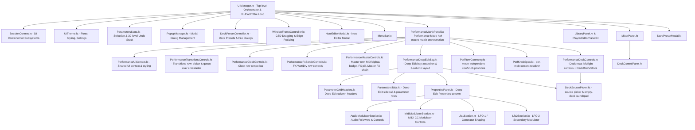

# UI Architecture & ImGui Systems

The `ui/` package manages the immediate-mode desktop interface using ImGui (`imgui-java`), LWJGL 3, and GLFW. This document maps component ownership, memory safety patterns, popup scheduling, and the `NoteEditorModal` architecture.

---

## Component Dependency Graph


```mermaid
graph TD
    UIManager[UIManager.kt - Top-level Orchestrator & GLFW/ImGui Loop]
    
    SessionContext[SessionContext.kt - DI Container for Subsystems]
    UITheme[UITheme.kt - Fonts, Styling, Settings]
    ParametersState[ParametersState.kt - Selection & 30-level Undo Stack]
    PopupManager[PopupManager.kt - Modal Dialog Management]
    DeckPresetController[DeckPresetController.kt - Deck Presets & File Dialogs]
    WindowFrameController[WindowFrameController.kt - CSD Dragging & Edge Resizing]
    NoteEditorModal[NoteEditorModal.kt - Note Editor Modal]
    
    UIManager --> SessionContext
    UIManager --> UITheme
    UIManager --> ParametersState
    UIManager --> PopupManager
    UIManager --> DeckPresetController
    UIManager --> WindowFrameController
    UIManager --> NoteEditorModal
    
    UIManager --> MenuBar[MenuBar.kt]
    UIManager --> MixerPanel[MixerPanel.kt]
    UIManager --> LibraryPanel[LibraryPanel.kt & PlaylistEditorPanel.kt]
    UIManager --> PerformanceMatrixPanel[PerformanceMatrixPanel.kt - Performance Mode 4x4 macro matrix orchestration]

    PerformanceMatrixPanel --> PerformanceUiContext[PerformanceUiContext.kt - Shared UI context & styling]
    PerformanceMatrixPanel --> PerformanceTransitionsControls[PerformanceTransitionsControls.kt - Transitions row: picker & queue over crossfader]
    PerformanceMatrixPanel --> PerformanceClockControls[PerformanceClockControls.kt - Clock row tempo bar]
    PerformanceMatrixPanel --> PerformanceFxSendsControls[PerformanceFxSendsControls.kt - FX Wet/Dry row controls]
    PerformanceMatrixPanel --> PerformanceMasterControls[PerformanceMasterControls.kt - Master row: MIX/alphas badge, FX pill, Master FX chain]
    PerformanceMatrixPanel --> PerformanceDeckControls[PerformanceDeckControls.kt - Deck rows left/right controls + DeckRowMetrics]
    PerformanceMatrixPanel --> PerfRowGeometry[PerfRowGeometry.kt - mode-independent row/knob positions]
    PerformanceMatrixPanel --> PerfKnobSpec[PerfKnobSpec.kt - per-knob content resolver]
    PerformanceMatrixPanel --> PerformanceDeepEditBay[PerformanceDeepEditBay.kt - Deep Edit bay accordion & 3-column layout]

    PerformanceDeepEditBay --> ParameterGridHeaders[ParameterGridHeaders.kt - Deep Edit column headers]
    PerformanceDeepEditBay --> ParametersTabs[ParametersTabs.kt - Deep Edit side rail & parameter rows]
    PerformanceDeepEditBay --> PropertiesPanel[PropertiesPanel.kt - Deep Edit Properties column]
    PerformanceDeepEditBay --> DeckSourcePicker[DeckSourcePicker.kt - source picker & empty-deck launchpad]
    PerformanceDeckControls --> DeckSourcePicker

    PropertiesPanel --> AudioModulatorSection[AudioModulatorSection.kt - Audio Followers & Controls]
    PropertiesPanel --> MidiModulatorSection[MidiModulatorSection.kt - MIDI CC Modulator Controls]
    PropertiesPanel --> Lfo1Section[Lfo1Section.kt - LFO 1 / Generator Shaping]
    PropertiesPanel --> Lfo2Section[Lfo2Section.kt - LFO 2 Secondary Modulator]
    
    MixerPanel --> DeckControlPanel[DeckControlPanel.kt]
    UIManager --> SavePresetModal[SavePresetModal.kt]
```

Most panel `draw(...)` methods (like `PerformanceMatrixPanel`) receive `session: SessionContext`, the current `Mixer` reference, and `parametersState: ParametersState` at frame render time. Other panels like `MixerPanel` and `DeckControlPanel` receive state via dependency injection in their constructors. Panels access subsystems (`AudioEngine`, `CVRegistry`, `PresetManager`, `PlayQueueManager`, `NotesManager`) via `session` rather than direct global singletons.

Deck preview monitors (`Deck A`, `Deck B`, `Deck BG`, `Deck PV`) in `MixerPanel` and `DeckControlPanel` render clean video monitors maximizing active preview area without non-image toolbar clutter. Former toolbar rows above the images (Save, Eject, and preset name box) and the crossfader transition button have been removed from the Mixer strip; saving presets is handled via keyboard shortcuts (`Ctrl+S`/`Cmd+S`) or Gen Browse, deck loading is handled via Browser drag-drop, and transition selection is configured via Deep Edit or Browser drag-drop onto the crossfader slider. `MixerLayoutCalculator` dedicates full vertical space to video monitor rendering.

Each deck preview monitor features a standardized, symmetric dual-column overlay across all four decks:
- **Left Column**:
  - Vertical Fader: Channel Level / Alpha fader (`mixer.levelA`, `levelB`, `levelBG`, `levelPV`) starting at the top margin and running downward. Supports drag, scroll wheel, and middle-click reset (100%).
  - Lower-Left Corner: Deck Badge (`[A]`, `[B]`, `[BG]`, `[PV]`) anchored directly below the Alpha fader. Clicking opens that deck in Deep Edit.
  - Die Button (`[🎲]`): Positioned in the bottom row directly to the right of the deck badge for modulators and base values randomization with undo support.
- **Right Column**:
  - Vertical Fader: FX Wet/Dry fader controlling `deck.fxChain.dryWet`, perfectly aligned with the Alpha fader from the top margin downward. Supports drag, scroll wheel, and middle-click reset (100%). Dims automatically when FX is bypassed/killed.
  - Lower-Right Corner: Square `[FX]` Kill button positioned directly below the FX fader. Clicking toggles `deck.fxChain.enabled` (active vs. bypassed/killed). Renders in deck theme color when active and high-visibility alert red when bypassed.
- **Corner Symmetry & Center Interaction**:
  - Both faders share identical vertical extent, stretching from the top margin down to 4px above the bottom corner buttons (`badgeMinY - 4px`).
  - Left-clicking the preview between the left and right overlay columns opens that deck in Deep Edit (sets `activeTopTab` and the deck's disclosure to `DEEP_EDIT`). Dragging from the center initiates deck copy, move, or swap routing, and dropping preset files directly onto the monitor loads the preset into the corresponding deck.

`MixerLayoutCalculator` calculates exact aspect preview sizes against available pane height and comprehensive vertical chrome (master controls, preset bars, separator bands, and safety margins). It utilizes the full pane width without reserving unconditional scrollbars, automatically scaling monitor previews to fit vertically without scrolling on standard screens, and displaying scrollbars only on extremely small display heights. It also calculates the exact maximum allowed window width (`calculateMaxAllowedWindowWidth`) to lock the Mixer panel to its ideal aspect-ratio width, preventing wasted letterbox blank space and ensuring the Performance panel / Library column absorbs all remaining display space. The Mixer is also capped so the Performance panel keeps `PerformanceMatrixPanel.calculateMinWidth()` (Deep Edit side rail + grid + a 450px Properties allowance).

---

## Key Core UI Orchestrators

### 1. `UIManager.kt` & Global Hotkey Routing (`Main.kt`)
- **Main Loop Integration**: Invoked once per frame (`render(mixer, width, height)`). Initialises and disposes `ImGuiImplGlfw` and `ImGuiImplGl3`. Zeroes `io.mouseWheelH` per frame to globally disable unintended horizontal scroll wheel panning from trackpads or trackpoints.
- **Global Key Routing (`Main.kt` & `UIManager.kt`)**: Chained GLFW key callback intercepts `F` (clean mode toggle), `B` (background video toggle), and `Ctrl-`/`Ctrl=` (Library preset name font scaling) whenever `!io.wantTextInput` or when clean mode is enabled. Spacebar (`LibraryPanel.cycleMode`) toggles the Library `HALF` $\leftrightarrow$ `FULL` when not typing; from Edit view it calls `LibraryPanel.show` instead (cancel Learn, collapse Deep Edit), as do `Ctrl+F` and `/`.
- **Three views (`UIManager.drawAssetManagementLayout`, `LibraryPanel.isEditView`)**: `UITheme.LibraryMode` is only `FULL` / `HALF` (a saved legacy `HIDE` loads as `HALF`). Perform = `HALF` with no module in Deep Edit; Edit = any module in Deep Edit and not `FULL`, where the Library window isn't drawn at all and the Performance panel gets the whole column height; Library = `FULL`. `ParametersState.setDisclosure` drops `FULL` to `HALF` when it opens a Deep Edit so the Edit view is actually visible. Deep Edit is solo-only (no `rackSoloMode`); the only exception is a Learn-pinned module. On load, at most one persisted expanded module is restored.
- **Workspace Layout Orchestration**: Lays out the Performance panel (top left, above the Library dock) and the Mixer (right, fitted to aspect preview height). Panels strictly enforce `ImGuiWindowFlags.NoScrollbar` with exact width calculation to prevent layout drifting. Vertical positioning below the 50% expanded top title bar uses `titleBarH + TITLE_BAR_PANEL_GAP` (`2.0f`), preserving an exact 2 px visual divider without hardcoded minimum bounds.
- **Title Bar Drag-to-Resize**: Supports vertical resizing of the docked Library by click-dragging empty areas of the Library menu bar.
- **Deferred Font Atlas Rebuilding**: Adjusting preset name scale sets `pendingFontRebuild`. Rebuilding the font atlas and OpenGL textures occurs at the **top of the next frame** (before `ImGui.newFrame()`) to prevent mid-frame atlas corruption.
- **Deferred Popup Triggering**: Modal popups set a `pendingOpen*` flag and execute `ImGui.openPopup(id)` at the root ID stack level outside child windows.
- **Modal Rendering Pipeline**: Invokes `NoteEditorModal.draw()`, `SavePresetModal.draw()`, and `PopupManager`'s specific draw methods (e.g. `drawExitPopup()`, `drawDeckConfirmPopups()`, `drawSourceChangeConfirmPopup()`, `drawMidiWarningPopup()`) at root scope.
- **Single workspace (Performance Mode)**: `PerformanceMatrixPanel.kt` (4×4 macro knob matrix + Deep Edit — see `docs/user_guide/macros_and_rack.md`) is the primary live editing view, orchestrating dedicated sub-controllers for clean separation of concerns:
  - `PerformanceUiContext.kt`: Shared styling colors (`PerformanceColors`), cached deck row mode states (`deckRowMode`), and label/module resolution helpers.
  - `PerformanceTransitionsControls.kt`: Transitions row controls: Line 1 transition picker (active shader/preset name with dirty marker) and TransitionQueue stepping (`< [N/Total] >`); Line 2 crossfader (Deck A/B snap badges, bipolar slider track, `[AUTO]`/`[FADING]` button, fade speed widget); right wing: randomize die button on Line 1 matching deck rows.
  - `PerformanceFxSendsControls.kt`: FX WET/DRY row right-wing Resync.
  - `PerformanceClockControls.kt`: Clock row's two control lines on the MASTER tab (line 1: clock-source pills, Link status, BPM readout, 4-beat dots; line 2: TAP with MIDI Learn on `Global/tapTempo`, RESYNC, ÷2/×2, ±0.5 nudge), reusing `AudioEngine`/`TapTempoController` actions like `TempoSyncPanel`. The row's knobs are `MacroEngine.GLOBAL` (canonical, so session-persisted; `MacroLearnState.sectionFor` = null, so unscoped). Column 3's `GLB` tab can't use `activeTopTab` (Deep Edit reads it), so `ParametersState.showGlobalMacros()` pins GLB to the current top-tab/sub-tab key and any navigation that changes that key drops back (`isGlobalMacrosShown`).
  - `PerformanceMasterControls.kt`: Master row controls: Line 1 `[MIX]` pill + `Deck Alphas & Master` badge (click to inspect in Deep Edit, right-click to reset levels) + `[100%]` reset button; Line 2 `[FX]` pill + Master FX `FxChainHeader` and right-wing Master `[FX]` toggle button. `[MIX]` and `[FX]` share a single unified hitbox toggle with green-active/dark-inactive styling. The row's mode is `PerformanceUiContext.isMasterRowFx` (`masterRowMode == "FX"` or Deep Edit Mixer sub-tab `FX`), mirroring the deck rows' `deckRowMode`/deck sub-tab rule; in FX mode the row's bankId is substituted to `MASTER_FX`; the badge still reads `MASTER`.
  - `PerformanceDeckControls.kt`: Deck rows left/right wing controls (stacked two-row left wing: shared hitbox SRC/FX toggle pills with green-active/dark-inactive styling, generator/preset badge, eject, queue navigation, Save, and kebab menu; Row 2 FX chain header controls; right wing: randomize die button on Row 1 directly above persistent `[BYPASS]` button on Row 2). The badge is a single control -- a preset is just a generator with its parameter values saved under a name, so there's no separate preset picker; `DeckRowMetrics.genBadgeW` absorbs the width the old separate preset combo used to occupy so `row1Width` doesn't drift.
  - `PerformanceMacroStrip.kt`: the Edit-row macro binding strip that replaces a row's left control *content* (never its geometry). Line 1: GLB tag, name (double-click rename), value, Learn/Cancel, binding chips 1-4, close; line 2: `MacroBindingEditor.drawLine`, a hint, or the read-only FX knob role (`FxMacroSummary.knobRole`). Visibility is the pure `macroStripModeFor(isEditView, rowBankId, selectedBankId)` in `MacroStripVisibility.kt`: NONE (Perform view or no selection), STRIP (the row's own bank is selected), GUEST (the GLOBAL bank is selected, drawn on whichever Edit row is open). `MacroLearnState.selectedControlId` / `selectedBindingIdx` drive it; hardware (Twister focus) selection must not set `selectedControlId`, or strips appear while performing. `MacroBindingNav.kt` holds the shared jump-to-target navigation. Column 3 is the Mixer only (the old MACROS tab, `MacroPanel`, `MacroBindingInspector` and `UITheme.column3Mode` are gone).
  - `PerformanceDeepEditBay.kt`: Deep Edit bay accordion, 3-column layout (side tabs, parameter grid, properties panel), and keyboard focus management (`keyboardOwnerModuleId`).
- **Perform pages (`PerfPageStore`, `PerfRows.CATALOG`)**: the Perform tabs are pages of exactly 4 catalog rows, loaded from `resources/perform_pages/*.json` and `library/perform_pages/*.json` (user file with the same `id` overrides; invalid files are skipped and logged). Page JSON has `version` (default 1, `PerfPageDef.CURRENT_SCHEMA_VERSION`, `migrate` hook for older files); a newer-version file loads, is listed in `PerfPageStore.warnings()`, and `saveUser` refuses to overwrite it (same policy as controller profiles, see `unified_control_mapping.md`). The active page id is `UITheme.performancePageId`. Catalog ids: `deck.A|B|BG|PV.srcfx`, `master`, `trans`, `wetdry`, `global`. Pinned halves (`RowDescriptor.pinnedMode`): `deck.<tag>.src|fx`, `master.mix|fx`; they bypass `withDeckRowMode`, never touch `deckRowMode`/`activeDeck*SubTab`/`masterRowMode`, and draw through the `pinned` parameter of the deck/Master control functions (static pill, other half empty). `catalogRowForModule` also takes the target half. Deep Edit's row for a module comes from `PerfRows.catalogRowForModule` (active page, then following pages wrapping), falling back to `rowDescriptorForModule`.
- **Performance Matrix row sizing (`PerformanceMatrixPanel.drawMatrix`)**: row height (`baseRowH`, computed in `draw`) is the Perform-view grid height divided by the page's row count (always `PerfPageDef.ROWS`), floored at `MIN_ROW_H` (68px) so all four rows fit above a HALF Library in a 1280x720 display's ~688px window (the PerformanceMatrix window also uses 4px vertical padding for this). In Edit view `UIManager` passes `hiddenLibraryH` (the HALF Library height that isn't drawn), so `baseRowH` and the knob diameter still come from the Perform layout (always 4 rows); the open row is exactly `baseRowH` tall (same as in Perform); the selected knob's highlight card and Learn button hang below the row and are drawn after the bay child (`overhangDraws`) so they sit over the bay's Browse/Params toggle line instead of growing the row. `PerformanceDeepEditBay.drawRackBayModule` has no title/Collapse header. Every knob, in every mode, has the same fixed strip under it for its caption or FX cell -- see §6c. Top header bar consolidates the tab strip (`[DECKS]` / `[MASTER]`), persistent Learn indicator, and `[ALL]` dice into a single compact 26px line. Each row's own `[EDIT]` toggle (`RackUnit.drawChevron`) uses a persistent label with green-active / dark-inactive styling to open and close Deep Edit; there is no toolbar-level close-edit control anymore -- Esc or **View → Close Deep Edit** close whichever row is open. Every row has the same shape: a title badge (`drawTitleBadge`) merged with the row's top-left corner, two stacked control lines, the knobs, and a right wing -- no row has a header band above its knobs. All title badges share a uniform 42px width across both tabs with descriptive unit tooltips on hover: Deck tags (`A`/`B`/`BG`/`PV` in H1), Master (`M` in H1), Transitions (`TR` in H1), Clock (`CLK` in H2), and Wet/Dry (`W/D` in H2). The MASTER tab's left wing reserves `transRowW` = max(`deckRow1W`, 38% of grid width, ≤420px) for Transitions (picker + queue nav over crossfader), while Master row matches the deck rows' FX row length (`masterRowW` = `DeckRowMetrics.row1Width(ctrlH, deckComboW)`), keeping both Master `[FX]` and `[MIX]` rows at the exact same length and alignment as the deck rows: Master = `[MIX]` + alphas badge over `[FX]` + chain header; FX Wet/Dry = badge only (Resync on the right); Clock = source/Link/BPM/beat dots over TAP/RESYNC/÷2/×2/±. Knobs scale between 20px and 100px (`PerfRowGeometry.MIN_DIAMETER`/`MAX_DIAMETER`; ~41px at 720p's compact rows). Wing controls use `ctrlH` (21px in compact mode, 24px otherwise). Click-drag scrolling comes from a grid-wide `##perf_grid_drag_scroll` invisible button submitted first with `setNextItemAllowOverlap()`, plus the title-band drop-zone buttons; each calls `applyDragScroll()`, which scrolls the child by `io.mouseDelta.y` while that item is active. The background button also stops an empty-space drag from moving the host window. The knob body blends toward its accent color on hover (22%) and while dragging (38%).
- **Glyph rule**: only [Icons] constants (baked from `lucide.ttf` via `ICON_RANGE`) and characters inside `UITheme.MAIN_RANGES` that Inter actually contains can render; anything else shows as `?`. `UiGlyphCoverageTest` scans every string literal in `src/main/kotlin` and fails on undrawable characters -- add an `Icons` constant (look up the codepoint in `lucide.ttf`) instead of pasting a Unicode symbol.

### 2. `TangoPalette.kt`, `UIThemeStyler.kt` & `SplitterManager.kt`
- **`TangoPalette.kt`**: The single source of every accent and status color in the app. Reproduces the actual Tango Desktop Project palette (8 hues x light/normal/dark: Butter, Orange, Chocolate, Chameleon, Sky Blue, Plum, Scarlet Red, Aluminium 1/2), plus Mixxx's own documented sync/link cyan extension (`#06AFDF` / `#34E2E2`, not one of the 8 core hues). Each hue is assigned to exactly one role so nothing collides: `DECK_A`/`DECK_B`/`DECK_BG`/`DECK_PV` (Orange/Sky Blue/Chocolate/Plum), `ACTIVE` (Chameleon: on/playing/armed), `ALERT` (Butter: unsaved/cue/caution), `DANGER` (Scarlet Red: bypassed/error/clipping), `SYNC` (the cyan extension: MIDI learn/Ableton Link/focus mode), and `NEUTRAL_LIGHT`/`NEUTRAL_DARK` (Aluminium 1/2: text, panels, master/neutral accents). No UI element should hand-roll its own RGB literal for one of these concepts -- reference the role constant instead. **`TangoPalette.inkFor(vararg backgrounds)`**: any call site that pushes a custom `ImGuiCol.Button`/`ButtonHovered`/`ButtonActive` background must also push a matching `ImGuiCol.Text` via `inkFor` (pass every shade the button cycles through) rather than leaving it to inherit the app's global default text color (Aluminium-1 off-white, tuned for the default *dark* button surface) -- that pairing reads as pale/off-white text on a light button once the background goes light. `inkFor` picks near-black or near-white ink from perceptual luminance (`0.299r+0.587g+0.114b`, 0.55 threshold), matching how Mixxx's Tango skin pairs dark text with its light hues (Butter, Aluminium 1) rather than outlining labels.
  **Semantic roles**: `TangoPalette.Role` objects (`BADGE_BG`, `BUTTON_BG`, `RANDOM_HOVER`, `MODE_ACTIVE`, `BEAT_DOT`, ...) hold a dark value and either a light RGBA or an ImGui style slot; resolve with `role.u32()` (theme is `TangoPalette.isLightTheme`, set in `UIThemeStyler.setupThemeColors`). Use `TangoPalette.learnBorder()` for MIDI-learn outlines. Add a role here rather than writing `if (isLight)` or an RGB literal at a call site.
- **`UIThemeStyler.kt`**: Applies the ImGui color palette for the built-in themes (`GREY_ACID` and `ORANGE_SUNSHINE`), manages window transparency/alpha blending when background video is enabled, and handles proportional `ImGuiStyle` styling. `GREY_ACID` is the dark/night mode built from `TangoPalette`'s Aluminium neutrals and Sync cyan accent. `ORANGE_SUNSHINE` is an outdoor/daytime high-contrast theme engineered with chalk off-white surfaces, jet-black text, crisp dark slate borders, and Tango Orange accents for glare resistance in direct summer sunlight, while preserving identical deck identity colors.
- **`SplitterManager.kt`**: Manages mouse hit-testing, resize cursors (`ResizeEW` / `ResizeNS`), double-click reset positions, and draw-list divider rendering for vertical and horizontal layout splitters.
- **`DropdownStyleHelper.kt`**: Shared styling for open combos/popups and their list rows. `pushOpenDropdownPadding()`/`popOpenDropdownPadding()` bracket a `beginCombo`/`beginPopup`/`beginPopupContextItem` call with roomy `WindowPadding`/`ItemSpacing`/`FramePadding` (3 style vars — if a call site needs its own scoped style-var push around the same call, push it *after* this one so a single post-`begin*` pop doesn't unwind the wrong entry). `selectableRow(label, isSelected, sizeX, flags)` is the standard replacement for `ImGui.selectable()` in any list/dropdown row: fixed `DROPDOWN_ROW_HEIGHT` (26px), always `SpanAllColumns`, and pure-white text on the selected/current row. New list/dropdown panels should use `selectableRow` rather than calling `ImGui.selectable()` directly, to stay visually consistent with the rest of the app.

### 3. `DeckPresetController.kt` & `ParametersKeyboard.kt`
- **`DeckPresetController.kt` Role**: Dedicated orchestrator for deck preset lifecycle, modal save/load/eject workflows, and file dialogs.
- **Deck Actions**: Coordinates move/copy/swap deck utilities with dirty-state checks, quick save vs "Save As" flow (`SavePresetModal`), duplicate copy naming (`_copy`), and ejecting with Auto-VJ dirty behavior resolution.
- **`ParametersKeyboard.kt` Keyboard Shortcuts**: Intercepts keyboard navigation and editing commands within Performance Mode's Deep Edit. `allowUndo` / `allowSave` / `allowCellEdits` let `PerformanceMatrixPanel` split them: undo runs every frame; save and cell edits run only inside the Deep Edit that owns the keyboard (`keyboardOwnerModuleId`: last clicked, else first open), while that Deep Edit's `rackSelectedCell` is swapped into `ParametersState`, and cell edits additionally require the Performance window to be focused:
  - `Ctrl+S` / `Cmd+S`: Saves the active deck preset directly if named, or opens the Save As modal if untitled. Ignored when focused on the Mixer or an empty deck.
  - `Shift+Ctrl+S` / `Shift+Cmd+S`: Opens the Save Preset As dialog for the active deck with auto-populated tags and duplicate name recommendation (`_copy`). Ignored when focused on the Mixer or an empty deck.
  - `Ctrl+Z` / `Cmd+Z`: Parameter and modulator undo.
  - `Ctrl+C` / `Ctrl+V`: Copy and paste of cell modulators or entire parameter rows.
  - `Delete` / `Backspace`: Resets active parameter or removes cell modulators.
- **Safe Visual Source Switching (`changeVisualSourceSafely`)**: Prompts user confirmation if changing visual sources when an active preset is loaded or dirty, resets active preset and cached DTO associations, clears stale selections in `ParametersState`, updates sub-tabs, and pushes an undo snapshot.
- **ImGui File Browsers**: Manages independent `ImGuiFileBrowser` dialogs for Deck A and Deck B and executes asynchronous disk I/O via `PresetManager`.

### 4. `NoteEditorModal.kt`
- **Role**: Stateful singleton modal editor for the 3-tier Note System.
- **`NoteContext` Sealed Class**:
  - `Param(deckLabel, paramKey, displayLabel)`: Edits parameter-level notes.
  - `Source(sourceId, displayName)`: Edits global visual source notes.
  - `Preset(deckLabel, presetName)`: Edits preset-level notes.
- **Zero-Allocation Buffer Safety**: Allocates a single `ImString(2048)` buffer at object instantiation (`textBuffer`). Calling `NoteEditorModal.request(context)` populates `textBuffer` with the current note text. Drawing `ImGui.inputTextMultiline` reuses this pre-allocated buffer every frame without heap allocation.

### 5. `UITheme.kt`
- **Fixed 95% Typography Hierarchy**: Core semantic font levels are permanently locked to 95% scaling (Caption: 12px, Body: 14px, Code: 14px, H3: 15px, H2: 18px, H1: 22px, Tooltip: 18px, baseSize: 14.25px). Fonts include Inter, JetBrains Mono, and Lucide icons merged via `setMergeMode(true)`.
- **Dedicated Library Preset Name Sizing (`FontLevel.PRESET_NAME`)**: Presets in the Library list, Playlists, and Play Queues are rendered via `FontLevel.PRESET_NAME`, which scales relative to `FONT_TOOLTIP` (10px–22px, defaulting to 18px at 100% scale) in 10% increments without affecting performance controls or deck headers. 10% steps ensure distinct, pixel-aligned font rasterization without glyph bounding box collisions.
- **Dedicated Tooltip & Performance Panel Font Sizing (`FontLevel.TOOLTIP`)**: Tooltips, open dropdown popups, Parameter Panel row labels (`ParametersRenderer.kt`, with `DEEP_EDIT_LABEL_COL_W = 185f`), and Browse Panels (`ShaderPickerPopup.kt`, `PerformanceBrowseBay.kt`, Library search bars) render using `FontLevel.TOOLTIP` (`FONT_BODY + 4f` = 18px, explicitly pushed with `font.legacySize`) for crisp, high-visibility live performance readability that matches between browsing, parameter adjustment, and tooltip inspection.
- **Proportional Icon Glyph Offset**: Lucide icons are configured with a scaled `setGlyphOffset(0f, round(size * 0.18f))` to ensure optical vertical centering and prevent icon bounding boxes from touching the top edge of buttons across all font sizes.
- **Critical Font Array Ownership**: Font `ByteArray` fields (`regularBytes`, `boldBytes`) and `iconRange: ShortArray` are stored as class fields. Calling `setFontDataOwnedByAtlas(false)` prevents native ImGui from attempting to free JVM-managed byte arrays.

### 6. Custom Sliders (`CustomRangeSlider.kt` & `BeatDivisionSlider.kt`)
- Compute row height (`h`), label positions (`labelY`), widget rows (`row2Y`), and center line (`centerY`) using calibrated typography metrics (`captionHeight`, `getFrameHeight()`) to ensure the "Current:" label and slider tracks never overlap adjacent rows or widgets.

### 6a. `CvModulatorSliderHelpers.kt` — Randomizable Slider Callback Bundle

Every `drawCustomRangeSlider` call operating on a `CvModulator` field requires three structurally identical callbacks: `onRandomizableChanged`, `onRangeChanged`, and `onValueChanged`. The helper function `cvModulatorSlider(...)` generates all three from a minimal description of which field is being bound:

```kotlin
val depthCbs = cvModulatorSlider(
    existing = existing,
    getValue = { depth }, getMin = { depthMin }, getMax = { depthMax },
    minLimit = 0f, maxLimit = 1f,
    copyWithRandomize = { enabled, nMin, nMax -> copy(randomizeDepth = enabled, depthMin = nMin, depthMax = nMax) },
    copyWithRange   = { sMin, sMax, v -> copy(depthMin = sMin, depthMax = sMax, depth = v) },
    copyWithValue   = { v -> copy(depth = v, depthMin = v, depthMax = v) },
    randomizeNow    = { randomizeDepth() },
    onReplace = onReplace,
)
// Pass callbacks directly into drawCustomRangeSlider named arguments:
//   onRandomizableChanged = depthCbs.onRandomizableChanged
//   onRandomizeNow        = depthCbs.onRandomizeNow
//   onRangeChanged        = depthCbs.onRangeChanged
//   onValueChanged        = depthCbs.onValueChanged
```

**Standard expansion logic** (`defaultOffset = 0.1f`): when enabling randomization and the range is currently collapsed (min == max), the range expands by `±defaultOffset`, clamped to `[minLimit, maxLimit]`. Sliders with non-standard expansion (e.g. beat subdivision uses index stepping, period/frame use multiplicative halving/doubling) keep their `onRandomizableChanged` inline and use the helper only for `onRangeChanged` / `onValueChanged`.

**Files using this helper:** `Lfo1Section`, `Lfo2Section`, `AudioModulatorSection`, `MidiModulatorSection`.

### 6b. Rotary Macro Knobs (`MacroKnobWidget.kt`) — Relative Motion & Cursor Locking
- **Relative Pointer Locking (`GLFW_CURSOR_DISABLED`)**: Dragging a rotary knob enters relative mode once motion exceeds a 3px deadzone (`DRAG_LOCK_DEADZONE_PX`). When **Shift** is held for fine-tuning, the deadzone is bypassed immediately on drag initiation so that fine micro-adjustments never leave the cursor visible over the value readout. The OS mouse pointer is hidden and confined, receiving unbounded relative motion deltas regardless of screen boundaries.
- **Robust Cursor Hiding & Wayland Compositor Safety**: `MacroKnobWidget` sets `ImGui.setMouseCursor(ImGuiMouseCursor.None)` while locked to suppress ImGui-rendered cursors, and `UIManager` assigns a 16x16 transparent GLFW cursor (`blankCursor`) while in `GLFW_CURSOR_DISABLED`. This guarantees that the cursor is completely invisible even on Wayland compositors and X11 window managers that do not automatically clear the cursor surface during pointer lock.
- **Wayland-Safe Coordinate Restoration**: Upon mouse release, `UIManager` calls `glfwSetCursorPos(windowHandle, originX, originY)` while still in `GLFW_CURSOR_DISABLED`, restores the default OS cursor (`glfwSetCursor(windowHandle, 0L)`), and returns to `GLFW_CURSOR_NORMAL`. Calling position hints prior to releasing pointer confinement satisfies Linux Wayland compositors (`zwp_pointer_constraints_v1`) where global pointer warping in normal mode is prohibited.
- **Safety Interruption Handling**: If the window loses focus (`glfwSetWindowFocusCallback` in `Main.kt`) or mouse button release is detected outside widget drawing, `MacroKnobWidget.abortDrag()` immediately resets internal lock state, restores the default cursor, and releases the cursor lock.
- **Hardware & User Preference Override**: Cursor locking is automatically bypassed when the performance touch console is active (`touchConsoleController.isActive`), or when toggled off via `UITheme.lockCursorOnKnobDrag` in **Preferences > General**.

### 6c. Performance Row Layout Contract (`PerfRowGeometry.kt`, `PerfKnobSpec.kt`, `DeckRowMetrics`)
A row's knobs can drive very different things over time -- source macros, the Master mix, an FX chain's Super Knob + slots (group mode), or a focused slot's dry/wet + parameters (focus mode). The rule is: **a mode changes what a knob shows, never where anything is drawn.**
- **Geometry (`PerfRowGeometry`)** is computed once per frame from the grid width, the row height, the BODY line height and the widest left/right control blocks. It takes no mode and no bank id. Every knob gets the same face plus a fixed **strip** underneath it, `max(BODY line, FxSlotCell.HEIGHT, FxParamCell.HEIGHT)` tall. The strip holds either the knob's caption or an FX cell. The side-button stack (link / bypass / reset) has space reserved on *both* sides of every knob, so the knob stays centered in its column. Row height depends only on the Perform-view tab's row *count*, never on its rows' modes.
- **Content (`PerfKnobResolver.resolve`)** turns a bank + optional `FxRowState` into up to four `KnobSpec`s. Each spec says what goes in the strip (`UnderKnob.Label` / `SlotCell` / `ParamCell`), which side buttons to draw (`SideButtons.None` / `LinkAndBypass` / `Bypass` / `Reset`), and any value overlay on the knob face. It is pure, so every mode is unit-tested.
- **Drawing (`PerformanceMatrixPanel.drawMatrix`)** reads positions only from the geometry and content only from the specs. `MacroKnobWidget` draws only the knob face (and an in-face value overlay); it has no caption or value-line drawing of its own. Captions go through `drawStripLabel` (BODY, ellipsized via `TextFit`, vertically centered like the FX cells). Deep Edit's Learn button and selection card are deferred to `overhangDraws` and drawn below the row, past the grid child's clip rect.
- **Side control widths (`DeckRowMetrics`)** are the single source for both the deck row's left controls and the width the matrix reserves for them (`row1Width`, taken at the full `CTRL_H` and the wider of queue nav vs. PV's badge). Change a button there, not in two places.
- **Deck mode predicate**: `PerformanceUiContext.isDeckRowFx(tag, parametersState)` is the only SRC/FX check for deck rows.
- `PerfRowLayoutTest` guards all of the above: the strip fits labels and cells, knob + strip fit inside the row at 1000-1920 px widths and 68-220 px rows, side buttons stay inside their column and clear the left controls, `row1Width` matches the drawn controls, and each resolver mode produces the right content.

### 6d. Inline Browse Content (`PerformanceBrowseBay.kt`, `ShaderPickerPopup.kt`) — Modal Pickers Replaced
A row's Edit bay (see the Modular Rack in §9/macros_and_rack.md) shows one of two content modes, tracked globally in `ParametersState.rackSectionMode`: `PARAMS` (Deep Edit's parameter grid, `PerformanceDeepEditBay.drawRackDeepEdit`) or `BROWSE` (`PerformanceBrowseBay.draw`). Opening either goes through `ParametersState.setDisclosure` first, so Browse gets the same solo row-collapse as Deep Edit for free — there's no separate disclosure level.
- **Context-Aware Monitor Clicks (`ParametersState.openFromMonitor`)**: Clicking a deck's confidence monitor or preview monitor is context-aware to eliminate per-deck stickiness:
  - When the rack bay is **collapsed**, clicking any monitor opens the **Editor** (`PARAMS`).
  - When the rack bay is **already open**, clicking another deck's monitor **preserves the active mode**: if currently editing, it stays in `PARAMS`; if currently browsing, it stays in `BROWSE` and carries over the active browse target type (`Gen` vs. `FxChain`).
- **Triggers**: `ParametersState.openGenBrowse`/`openFxChainBrowse`/`openTransitionBrowse` set the target `BrowseTarget` (`Gen` / `FxChain(slotIndex)` / `Transition`), the right subtab (`setDeckSubTab`/`activeMixerSubTab`), and open Deep Edit in `BROWSE` mode. Every former `ShaderPickerPopup`-opening click site calls one of these instead — deck generator/preset badge, FX chain name (`FxChainHeader`), FX slot name (`FxSlotCell`, via an `onOpenBrowse: (Int) -> Unit` callback), and the transition name (both its own row button and the Deep-Edit CTRL/TRANS selector).
- **Row [Edit] Button (`RackUnit.drawChevron`)**: Expanding a collapsed rack unit via its `[Edit]` button explicitly calls `openParams` to always open the parameter editor.
- **Content dispatch** (`PerformanceBrowseBay.draw`): a deck module branches on `getActiveSubTab(deckLabel)` (SRC → Gen picker, FX → chain browse); the Master module branches on `activeMixerSubTab` (TRANS → transition picker, FX → chain browse, else falls back to Params — there's nothing to browse in MIX/CTRL). FX chain browse itself has `Chain`/`FX1`/`FX2`/`FX3` sub-tabs tracked in `rackBrowseTarget[moduleId]`'s `slotIndex` (`null` = Chain).
- **`ShaderPickerPopup`** is a stateful singleton like before, but no longer a `beginPopupModal`. `ensureInline(contextKey, ...)`/`ensureInlineFx(contextKey, ...)`/`ensureInlineSource(contextKey, ...)` (re)configure it — cheap to call every frame, since search text/category filters only reset when `contextKey` changes (a different Browse target) — and `drawInline(session)` renders the search bar, multi-select category dropdown, and results table in `FontLevel.TOOLTIP` (18px) with no popup chrome. Selecting a row applies via the caller's callback and does not close or reset anything, so rapid-fire re-picking works without reopening.
  - **Gen Browse merges generators and presets**: the `SOURCE` picker type lists stock `VisualSourceRegistry` types *and* saved deck presets (`.lsd` files) together, always both — a preset is just a generator with its parameter values saved under a name, so there's one list, not two. `ensureInlineSource` yields a `SourcePick` (`Id` for a stock type or external-video id, `Saved(file)` for a preset, `None`); `PerformanceBrowseBay.drawGenBrowse` routes `Id` through `DeckSourcePicker.applyPickedSourceId` and `Saved` through `session.presetRepository.loadDeckPresetAsync`. Saved-preset rows get a "⋮" management button (Rename/Edit Tags, Duplicate, Delete) reusing `BrowserPopupHandler`, the same handlers the Library's `PresetListPanel` uses. A floppy-disk Save/Save As button sits above the list, wired to the same `DeckPresetController.handleSaveDeck` flow as the Mixer's own Save button and Ctrl+Shift+S.
  - **Delete confirmation is drawn globally, not just from `LibraryPanel`**: `BrowserPopupHandler.drawDeleteAssetConfirmationPopup()` self-triggers off `pendingOpenDeletePopup` and is called unconditionally once per frame from `UIManager` (next to `SavePresetModal.draw`), because it can now be triggered from Gen Browse while a rack module is in Deep Edit — exactly when `LibraryPanel.isEditView` is true and the whole Library dock (which used to be the only place this popup was opened/drawn) is skipped.
- **Bay tab row**: `PerformanceDeepEditBay.drawModeTabs` draws `Edit | SRC/TRANS | Chain | FX1-3` above whichever content is showing, for every module in `deepEditModuleIds`. The active tab is derived from `ParametersState.sectionModeFor` + `browseTargetFor` (no extra state); clicks call `openParams`/`openGenBrowse`/`openFxChainBrowse`/`openTransitionBrowse`. No transactional Cancel/Apply — Browse applies on click same as Deep Edit's own param editing; Ctrl+Z (`ParametersUndo`) is the only safety net.

### 7. `PreferencesPanel.kt` & `ShortcutManager.kt` Architecture
- **Docked 2/3 Workspace Panel**: `PreferencesPanel` renders as a dedicated docked panel occupying the left ~2/3 of the screen (`libraryW = displayWidth - rightW`), leaving the Mixer column (Decks A/B, preview, crossfader, master meters) active and fully interactive on the right. It features a top header bar with breadcrumb navigation (`${Icons.SETTINGS} Preferences › Category`) and an explicit `[✕ Close]` button (`Esc`).
- **Preferences Category Routing**: `PreferencesPanel` organizes application preferences into 9 clean categories (`GENERAL`, `SHADER_LOCATIONS`, `VIDEO_DISPLAY`, `AUDIO_ENGINE`, `TEMPO_SYNC`, `MIDI_CONTROLLER`, `OSC_CONTROLLER`, `SHORTCUTS`, `BROADCAST`) and supports targeted opening via `PreferencesPanel.open(category)`. Calling `PreferencesPanel.close()` or pressing `Esc` instantly restores the previous workspace view (Performance Matrix + Library dock, or Deep Edit module). Toggling via `Ctrl+P` or the menu bar cleanly alternates between open and closed.
- **Keyboard Shortcuts Overhaul (`ShortcutManager.kt`)**: Keyboard shortcut definitions, custom keybindings, and collision detection are centralized within `llm.slop.liquidlsd.ui.shortcuts`:
  - **`KeyCombination`**: Data model representing primary GLFW keys and modifier bitmasks (`Ctrl`, `Shift`, `Alt`, `Super`/`Cmd`) with human-readable string formatting.
  - **`ShortcutAction` & `ShortcutCategory`**: Defines action ID, category, name, detailed description, default key, current key, and collision exception rules.
  - **`ShortcutManager`**: Manages action registration, persistent JSON serialization (`~/.liquidlsd/keybindings.json`), key matching, and scope-aware collision detection.
  - **Preferences Grid UI**: `PreferencesPanel.kt` renders a 2-column grid layout with **Action & Description on the Left** and **Shortcut Key Badges & Rebind Controls on the Right**. Features live search filtering (`Icons.SEARCH`), interactive key recording modal, conflict warning alerts (`Icons.ALERT`), conflict tooltips, key swapping, and factory default resets (`Icons.REFRESH`).
- **Unified Modulator Control**: Enabling an engine subsystem (`audioEngineEnabled`, `midiEnabled`, `sequencerEnabled`) automatically determines column visibility in Deep Edit's parameter grid and Properties column. The column-header kebab menu (`⋮`), positioned immediately left of the `VAL` column header (vertically aligned with the row kebabs, `ParameterGridHeaders.KEBAB_W`), acts as a quick-switchboard to toggle these subsystems directly without modal navigation.
- **Audio Engine Tab & Oscilloscopes (`AudioEnginePanel.kt`)**: The audio subsystem UI is encapsulated within `AudioEnginePanel.kt` and drawn in a balanced two-column layout:
  - **Left Column**: Backend, input hardware device, channel routing dropdowns positioned inline on the same line as their text labels; Input Gain and System Volume sliders located below Channel Routing; sync state, and beat synchronization / detection controls (manual BPM locking, Beat Tracker target band, detection presets, dual-headed BPM range slider). Colored backend status ("Jack active", "Java Sound Active", or "Audio Inactive") is displayed inline to the right of the "Enable Audio Engine" checkbox.
  - **Right Column**: Real-time 2-channel stereo Input Peak Meter (L / R) at the top, followed by 10 uniformly sized oscilloscopes (height 50 px) in a balanced 5×2 comparison grid: Raw Buffer on row 0 left directly beside Beat Sine Oscillator on row 0 right, followed by the four RMS energy bands (Full Mix, Bass Band, Mid Band, High Band) in the left column directly beside their corresponding Flux transient bands (Full Mix Transient, Kick Transient, Snare Transient, Hat Transient) in the right column.
  - MIDI controller detection status readout is located under Preferences > General inline to the right of the "Enable MIDI" checkbox.
- **Audio Engine Quick Access**: Clicking the real-time DSP latency metric in the top performance stats bar (or opening `File > Preferences... > Audio Engine`, or pressing `Ctrl+P` / `Cmd+P`) navigates directly to the `AUDIO_ENGINE` category.
- **Title Bar & Menu Bar Architecture (`MenuBar.kt`)**: The main menu bar consolidates application actions into clean top-level menus:
  - `File`: Preset creation (`New Preset`), `Preferences...` (`Ctrl+P` / `Cmd+P`), and `Exit`.
  - `View`: Preferences dismissal, Deep Edit collapse, and Library Drawer mode (`Full` / `Half`).
  - `Output`: `Secondary Output Window`, `Record Master Output (REC)`, `Web Broadcast`, and `Export Video (Offline Studio)...`.
  - `Help`: `Documentation`, update checker, and `Show Tooltips` toggle.
  - Contextual HUD status badges for recording (`REC mm:ss`, dropped frames counter), Web Broadcast (`LIVE`, `CONNECTING`, `LIVE ERR`), and Ableton Link (`LINK [peers]`) appear dynamically on the title bar only when active.
  - **CSD & Telemetry HUD Layout**: In frameless mode, Client-Side Decorations (Minimize, Maximize/Restore, Close) are anchored directly to the title bar's right boundary (`contentRightX`), ensuring the Close button is flush with the right boundary across all display resolutions. Monospace telemetry stats (CPU%, DSP execution latency, FPS, Frame Time, and FBO live count/estimated VRAM) render in a unified right-side block positioned cleanly to the left of the window controls. Musical timing controls (clock source toggle, Link status, BPM display, 4-beat phase meter dots, tap tempo, resync, half/double tempo, and nudges) are consolidated on the Performance MASTER tab's Clock row and within Preferences > Tempo & Sync.

### 8. `LibraryPanel.kt` & `BrowserActionToolbar.kt`
- **2x2 Grouped Container Layout**: The 4 Library columns are logically grouped into two side-by-side rounded container boxes (`LibraryGroup1` and `LibraryGroup2`) with 6 px rounding (`ChildRounding`), subtle dark background tinting (`ChildBg`), and border frames (`Border`).
  - **Group 1 (Assets & Setlists)**: Encloses Column 1 (Presets / FX Presets) and Column 2 (Playlist Editor / FX Chains).
  - **Group 2 (Live Play Queues)**: Encloses Column 3 (Background Queue) and Column 4 (Play Queue A/B).
- **`[ Presets ]` / `[ FX ]` View Mode**: `LibraryPanel`'s `LibraryViewMode` toggle swaps the content drawn in all four columns. In `[ FX ]` mode, Column 1 draws `FXBrowserPanel.kt` (unified stock/single/chain browser with tier badges and an All/Stock/Singles/Chains filter), Column 2 draws `FXPlaylistEditorPanel.kt` (`.lsdfxplay` curated sequences), and Columns 3/4 draw `FXBgQueueActionsPanel.kt` / `FXQueueActionsPanel.kt` (volatile live FX queues backed by `FXBgQueueManager.kt` / `FXQueueManager.kt`) in place of the normal preset `BgQueueManager` / `PlayQueueManager` panels. Both single presets (`.lsdfx`) and 4-slot chains (`.lsdfxchain`) resolve deterministically through `FXItemApplier.kt` → `Deck.applyFxChain` rather than arbitrary vacant-slot allocation. See `docs/developer/preset_management.md` §8 for the manager-level architecture.
  - A 8 px horizontal gap (`groupGap`) separates the two rounded group boxes, and the top edge of both boxes touches the bottom of the top toolbar menu bar.
- **Sticky Column Headers**: The 4 Library columns use inner child containers configured with `ImGuiWindowFlags.NoScrollbar or ImGuiWindowFlags.NoScrollWithMouse`. The top two rows of each column (header title + action buttons, followed by the filter/combo/control bar) remain pinned and sticky, while their items scroll independently in dedicated inner child windows (`##presets_scroll`, `##playlist_items_scroll`, `##queue_items_scroll`, `##bg_queue_items_scroll`).
- **Proportional Action Buttons & Balanced Padding (`BrowserActionToolbar.kt`, `LibraryPanel.kt`)**: Action buttons (Quick Audition Lock, Deck Load A/B/BG/PV, and Queue Q/BGQ) and window controls use a compact height of ~22 px (`btnH = 22f * fontScale`) with width dynamically calculated as ~1.5x button height (`calculateButtonWidth(btnH)`). Library title bar vertical frame padding is scaled to 6.0 px (`libTitleBarH = 32f`), preserving the ~2.5 px bottom margin while adding sufficient top clearance to prevent button borders from clipping against the horizontal splitter line.
- **Accurate Lucide PUA Mappings**: Audition latch toggle uses standard Lucide padlock codepoints (`Icons.LOCK = "\ue10b"`, `Icons.UNLOCK = "\ue10c"`).

### 9. Tooltip Subsystem & Ergonomic Positioning (`TooltipHelper.kt`)
- **Ergonomic Design Rationale**: Dear ImGui's built-in `setTooltip` positions popups strictly to the bottom-right of the mouse pointer (`mouse.x + 16, mouse.y + 10`), routinely obscuring parameter readouts, sliders, and adjacent matrix cells. In addition, Dear ImGui 1.86.12 lacks native hover delay flags (`ImGuiHoveredFlags.DelayNormal` was introduced in 1.88+). `TooltipHelper.kt` provides an ergonomic, zero-allocation tooltip positioning and delay subsystem.
- **Pure Geometric Quadrant Engine (`calculateTooltipPos`)**:
  - Calculates tooltip placement relative to a fixed $16 \times 22\,\text{px}$ cursor bounding box with a $4\,\text{px}$ vertical gap and $8\,\text{px}$ viewport margin.
  - **Beneath Pointer**: By default, places the tooltip below the cursor box (`targetY = mouseY + CURSOR_HEIGHT + CURSOR_GAP`) with its left edge aligned with the cursor's left edge (`targetX = mouseX`, `pivotX = 0.0f`).
  - **Right-Edge Alignment**: If the tooltip width overflows the right viewport edge (`mouseX + tipW > viewX + viewW - MARGIN`), it anchors to the cursor's right edge (`targetX = mouseX + CURSOR_WIDTH`, `pivotX = 1.0f`), extending cleanly to the left.
  - **Bottom-Edge Overflow Flip**: If the tooltip overflows the viewport bottom (`targetY + tipH > viewY + viewH - MARGIN`), it flips above the cursor box (`targetY = mouseY - CURSOR_GAP`, `pivotY = 1.0f`).
  - **Viewport Edge Clamping**: Clamps final window coordinates within viewport bounds `[viewX + MARGIN, viewX + viewW - MARGIN]`.
- **`ImGuiCond.Always` — Required to Override Dear ImGui's Internal Positioning**:
  - `prepareTooltipPos` uses `ImGuiCond.Always`. Dear ImGui's own `BeginTooltip()` internally calls `setNextWindowPos(mouse + offset, Always)` — any weaker condition such as `Appearing` is silently overridden, causing all tooltips to land at roughly the cursor hotspot position from frame 2 onward.
  - `Always` ensures our `setNextWindowPos` fires last, wins, and places tooltips at the computed quadrant position every frame.
- **Direct Top-Left Window Positioning with Zero ImGui Pivot**:
  - `prepareTooltipPos` converts the geometric result `(targetX, targetY, pivotX, pivotY)` directly into top-left window coordinates: `finalX = targetX - contentWidth * pivotX`, `finalY = targetY - contentHeight * pivotY` (clamped within display bounds), passing `(finalX, finalY)` to `setNextWindowPos` with a zero pivot `(0.0f, 0.0f)`.
  - In Dear ImGui, passing a non-zero pivot (e.g. `1.0f`) causes `SetNextWindowPos` to evaluate `pos -= window->SizeFull * pivot`. On frame 1 of a newly appearing tooltip, `window->SizeFull` is uninitialized `(0, 0)`, so ImGui applies a zero offset on frame 1 and only shifts the window on frame 2 when `SizeFull` is calculated. Pre-computing the top-left coordinate with zero pivot completely eliminates this frame-1 uninitialized size offset jump.
- **8-Slot Circular Size Cache**:
  - Custom tooltips cache their rendered width and height across frames in an 8-slot circular ring buffer. Hovering across rows in Parameters or switching between deck tooltips retains recent dimensions, guaranteeing immediate accurate quadrant placement without cache churn.
- **`ImGuiCol.Text` and `ImGuiCol.Border` Theme Isolation**:
  - All tooltip helpers push `ImGuiCol.Text` and `ImGuiCol.Border` using `TooltipHelper.baseTextColor` and `TooltipHelper.baseBorderColor` before `beginTooltip()`. This prevents styling state from calling widgets (such as `BrowserDeckButtons.push()`, which colors text and borders with deck accents) from bleeding into the tooltip window and its border.
  - `UIThemeStyler.setupThemeColors()` sets both base colors whenever the theme is applied or switched.

- **Zero-Allocation Hover Delay Tracker (`shouldShowTooltip`)**:
  - Tracks hover state without runtime heap allocations using a spatial hash key combining item bounding rect and content: `(minX.toInt() shl 16) xor minY.toInt() xor text.hashCode()`.
  - Compares `ImGui.getFrameCount()` against `lastHoveredFrame` to detect cursor departures or transitions between adjacent widgets.
  - Suppresses rendering until the cursor hovers continuously for $250\,\text{ms}$ (`DEFAULT_HOVER_DELAY_MS`), preventing distracting visual flashing during mouse sweeps across sliders, buttons, and grid cells.
- **Standardized UI Integration API**:
  - `itemTooltip(text: String, delayMs: Long = 250L)`: Replaces the verbose boilerplate pattern `if (isItemHovered() && tooltipsEnabled) ImGui.setTooltip(text)` across all UI panels.
  - `itemTooltip(delayMs: Long = 250L, block: () -> Unit)`: Renders custom multi-section tooltips with dimension measurement caching.
  - `showTooltip(text: String)`: Positions and displays an ergonomic tooltip when hover detection is handled externally (e.g. within complex custom slider hitboxes).
  - `controlTooltip(block: ControlTooltipBuilder.() -> Unit)`: High-level declarative API for interactive controls (knobs, sliders, buttons). Enforces the canonical 3-tier layout:
    1. **Header & Context**: Control Label / formatted value / state badge, followed by target parameter routing (`Bound to: ...`) or context description.
    2. **Interactive Gestures** (in canonical Order 2 with bullet indicators `•` and blank line chunking):
       - `• Drag to <action>` (Primary physical manipulation)
       - `• Shift-drag to <action>` (Precision modifier)
       - `• Scroll to <action>` (Continuous wheel adjustment)
       - `• Left-click to <action>` (Primary selection / inspection / toggle)
       - `• Double-click to <action>` (Direct numeric typing / reset / focus)
       - `• Middle-click to <action>` (Center / reset to default)
       - `• Right-click for <action>` / `Right-click to <action>` (Learn / context menu)
    3. **Hardware / Protocols / Integrations**: OSC and MIDI endpoints (`OSC: ...`, `MIDI: ...`).
  - `buildControlTooltip(block: ControlTooltipBuilder.() -> Unit): String`: Pure string-generation version of the builder for unit testing or custom tooltip composition.

---

## ImGui Native Memory & Allocation Rules

Because ImGui uses JNI wrappers around native C++ pointers, strict memory rules must be followed across all `ui/` files to prevent JVM SegFaults and Garbage Collection pauses:

| Wrapper Type | Instantiation Rule | Cleanup Rule |
|--------------|-------------------|--------------|
| **`ImString`** | Allocate as **class/field-level variable**. Never allocate locally inside `draw()`. | Reused frame-to-frame. |
| **`ImBoolean` / `ImInt`** | Class field if state persists; local variables allowed only in rare modal popups. | Reused frame-to-frame. |
| **`ImGuiStyle`** | Class/singleton instance. | Must call `.destroy()` in `dispose()`. |
| **`ImFontConfig`** | Instantiated per font build. | Must call `.destroy()` immediately after loading. |

---

## Pattern for Adding a New UI Panel

1. **Pre-allocate String Buffers**: Define all `ImString` fields at the class/object level (e.g. `val searchBuffer = ImString(256)`).
2. **Inject Context at Draw Time**: Accept `session: SessionContext`, `mixer: Mixer`, and `parametersState: ParametersState` in the `draw(...)` signature.
3. **Use Deferred Root Popups**: To open a popup, set a `pendingOpen` flag and call `ImGui.openPopup(id)` at the root ID level.
4. **Register in `UIManager`**: Hook panel rendering into `UIManager.render()`.

---

## ImGui Versioning & Future Modernization

Liquid LSD is on `io.github.spair:imgui-java:1.92.7.1` (Dear ImGui 1.92, universal macOS arm64/x64 native support). For the migration history from 1.86.12 and the ARM64 native build story, refer to [ImGui Upgrade & Modernization Guide](imgui_upgrade_guide.md).

---

## Proposals & RFCs

- [Relative Knob Dragging & Cursor Locking / Restoration RFC](knob_drag_cursor_locking_rfc.md): Architectural analysis, platform pitfalls (Wayland pointer constraints vs X11/macOS), and edge cases for cursor locking during knob adjustments.

