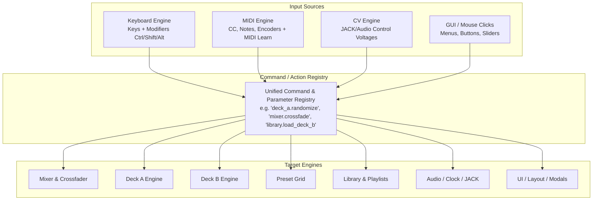

# Unified Control Mapping Architecture (MIDI / Keyboard / Mouse / CV)

> **Status**: Architectural Brainstorm & Design Specification (Roadmap)  
> **Inspiration**: [Mixxx DJ Software](https://mixxx.org/) Controller & Keyboard Mapping Architecture

---

## 1. Executive Summary & Vision

Liquid LSD is designed for high-energy, real-time live visual performance (VJing). While the existing application supports mouse manipulation, a subset of MIDI CC parameters, and CV modulation for select controls (like crossfading and play queue stepping), the long-term goal is **full control parity across all input modalities**:

1. **Hardware MIDI Controllers** (Faders, Knobs, Endless Encoders, Drum/Grid Pads, Pitch Wheels).
2. **Computer Keyboard** (Standard QWERTY keys, Modifiers: `Ctrl`, `Shift`, `Alt`/`Option`, `Meta`).
3. **Control Voltage (CV) / Audio Modulation** (LFOs, Audio Envelopes, JACK Audio/CV ports).
4. **Mouse & Touchpad** (GUI clicks, drags, context menus).

Any action that can be performed via a mouse click or menu selection should be exposable as a bindable **Command / Action Object** that can be assigned to keyboard shortcuts, MIDI controls (via MIDI Learn or config profiles), CV modulation, or combined macro triggers.

---

## 2. Architectural Model

### 2.1 Decoupled Action / Command Registry
Rather than hardcoding keyboard handlers or mouse click callbacks inside ImGui rendering passes:
- Every action is registered with a unique path identifier (e.g. `[DeckA],randomize`, `[Mixer],crossfade`, `[Library],navigate_down`, `[Grid],trigger_cell_a`).
- Actions define their input characteristics:
  - **Trigger / Momentary**: Fires once on press, or stays active while held (e.g. stutter cut, blackout).
  - **Continuous / Scalar**: Accepts a normalized range $[0.0, 1.0]$ with optional custom scaling.
  - **Stepped / Relative**: Accepts relative delta ticks (e.g. $+1$ / $-1$ from rotary encoders or arrow keys).
  - **Toggle**: Flips boolean state on press.

### 2.2 Input Handling Behaviors
- **Stutter / Cut Mode (Momentary Gate)**: Pressing a key/pad instantly slams a parameter (e.g. Crossfader to Deck A, or Master Blackout); releasing the key restores the previous state.
- **Nudge / Step Mode**: Pressing a key increments or decrements a continuous value by a configurable delta (e.g. BPM $\pm 0.1$, Rotation Speed $\pm 5\%$).
- **Relative Encoders (Endless Knobs)**: Support for 2's complement and binary offset modes used on DJ hardware for smooth library scrolling and parameter tweaking without value jumps.
- **Hardware Feedback (MIDI Out / LED Matrix)**: Outputting state back to hardware (e.g. lighting Launchpad grid pads to match preset cell colors, flashing beat sync LEDs).

---

## 3. Comprehensive Inventory of User Actions

The following is an exhaustive breakdown of every user-accessible function, menu choice, button, and slider in Liquid LSD to be registered in the unified command table.

### 3.1 Global Transport, Projects & Application
| Action Identifier | Description | Default Target |
|---|---|---|
| `app.save_preset` | Save current preset / active state | File IO |
| `app.save_preset_as` | Open Save Preset dialog | Modal |
| `app.open_project` | Open project load dialog | File IO |
| `app.export_video` | Open Video Export modal | Modal |
| `app.toggle_settings` | Open / Close Settings panel | UI |
| `app.toggle_performance_stats` | Toggle FPS / CPU / GPU metrics overlay | UI |
| `app.toggle_fullscreen` | Toggle borderless fullscreen | Window |
| `app.undo` | Undo last preset / grid modification | State |
| `app.redo` | Redo last undone modification | State |
| `app.quit` | Safe application exit | Engine |

---

### 3.2 Mixer & Crossfader Section
| Action Identifier | Description | Input Mode |
|---|---|---|
| `mixer.crossfade` | Crossfader position (0.0 = A, 1.0 = B) | Continuous |
| `mixer.crossfade_snap_a` | Snap crossfader instantly to Deck A (0%) | Trigger |
| `mixer.crossfade_snap_b` | Snap crossfader instantly to Deck B (100%) | Trigger |
| `mixer.crossfade_snap_center` | Snap crossfader to exact Center (50%) | Trigger |
| `mixer.crossfade_stutter_a` | Hold to cut to Deck A; release to restore | Momentary |
| `mixer.crossfade_stutter_b` | Hold to cut to Deck B; release to restore | Momentary |
| `mixer.crossfade_nudge_left` | Nudge crossfader left by step | Step |
| `mixer.crossfade_nudge_right` | Nudge crossfader right by step | Step |
| `mixer.auto_crossfade_trigger`| Start automated crossfade transition | Trigger |
| `mixer.auto_crossfade_speed` | Adjust auto-crossfade duration (beats/sec) | Continuous / Step |
| `mixer.curve_select` | Cycle / select transition blend curve | Stepped |
| `mixer.master_brightness` | Master opacity / dimmer level | Continuous |
| `mixer.blackout` | Blackout all video output (momentary/toggle) | Momentary / Toggle |
| `mixer.whiteout_strobe` | Flash master output to pure white | Momentary |
| `mixer.queue_prev` | Play previous item in play queue | Trigger |
| `mixer.queue_next` | Play next item in play queue | Trigger |
| `mixer.toggle_auto_vj` | Enable / disable Auto-VJ automated setlist playback | Toggle |

---

### 3.3 Deck Controls (Independent for `deck_a` and `deck_b`)
Replace `deck_x` with `deck_a` or `deck_b` (or `deck_selected`):

| Action Identifier | Description | Input Mode |
|---|---|---|
| `deck_x.load_active_preset` | Load currently selected library preset into deck | Trigger |
| `deck_x.clear_deck` | Reset deck to blank default state | Trigger |
| `deck_x.reload_preset` | Discard unsaved deck changes and reload preset | Trigger |
| `deck_x.save_to_preset` | Save current deck state as a preset | Trigger |
| `deck_x.mute` | Mute / blank deck output | Toggle |
| `deck_x.solo` | Solo deck (preview directly to master) | Toggle |
| `deck_x.randomize` | Randomize all unlocked parameters | Trigger |
| `deck_x.mutate` | Mutate / drift unlocked parameters slightly | Trigger |
| `deck_x.lock_all` | Lock all parameters against mutation | Trigger |
| `deck_x.unlock_all` | Unlock all parameters | Trigger |
| `deck_x.toggle_param_lock` | Toggle lock for specific parameter | Toggle |

---

### 3.4 Mandala & Shader Synthesis Parameters (Per Deck)
| Action Identifier | Description | Input Mode |
|---|---|---|
| `deck_x.geometry.shape` | Select / cycle geometric shape mode | Stepped / Continuous |
| `deck_x.geometry.symmetry` | Adjust petal count / radial symmetry order | Continuous / Step |
| `deck_x.geometry.zoom` | Adjust camera zoom / scale | Continuous |
| `deck_x.geometry.rotation` | Adjust static rotation angle | Continuous |
| `deck_x.geometry.spin_speed` | Adjust dynamic rotation speed & direction | Continuous |
| `deck_x.geometry.layer_count` | Adjust number of nested visual layers | Continuous / Step |
| `deck_x.geometry.blend_mode` | Cycle layer blend modes (Add, Multiply, Screen) | Stepped |
| `deck_x.color.palette_select` | Select color palette (previous/next or direct) | Stepped / Index |
| `deck_x.color.hue_shift` | Hue rotation fader ($0^\circ \dots 360^\circ$) | Continuous |
| `deck_x.color.saturation` | Saturation boost / desaturate fader | Continuous |
| `deck_x.color.brightness` | Brightness / level fader | Continuous |
| `deck_x.color.contrast` | Contrast curve fader | Continuous |
| `deck_x.color.invert` | Invert colors toggle | Toggle |
| `deck_x.color.cycle_speed` | Palette color cycling speed | Continuous |
| `deck_x.mod.lfo1_rate` | LFO 1 frequency / beat division | Continuous / Stepped |
| `deck_x.mod.lfo1_depth` | LFO 1 modulation depth | Continuous |
| `deck_x.mod.lfo1_shape` | LFO 1 waveform (Sine, Tri, Saw, Square, S&H) | Stepped |
| `deck_x.mod.lfo2_rate` | LFO 2 frequency / beat division | Continuous / Stepped |
| `deck_x.mod.lfo2_depth` | LFO 2 modulation depth | Continuous |
| `deck_x.mod.trigger_manual` | Manual trigger pulse for trigger modulator | Trigger |

---

### 3.5 Preset Grid & Performance Matrix
| Action Identifier | Description | Input Mode |
|---|---|---|
| `grid.trigger_cell_a(x, y)` | Load preset at grid $(x, y)$ into Deck A | Trigger |
| `grid.trigger_cell_b(x, y)` | Load preset at grid $(x, y)$ into Deck B | Trigger |
| `grid.preview_cell(x, y)` | Preview preset at grid $(x, y)$ in monitor | Trigger |
| `grid.clear_cell(x, y)` | Clear / delete preset at grid cell $(x, y)$ | Trigger |
| `grid.edit_cell_notes(x, y)` | Open Note Editor modal for cell $(x, y)$ | Trigger |
| `grid.tab_select(index)` | Select preset grid tab / bank $(1 \dots N)$ | Index |
| `grid.tab_next` | Switch to next grid tab | Trigger |
| `grid.tab_prev` | Switch to previous grid tab | Trigger |
| `grid.tab_add` | Create new preset tab | Trigger |
| `grid.tab_rename` | Rename active preset tab | Trigger |

---

### 3.6 Library & Asset Browser
| Action Identifier | Description | Input Mode |
|---|---|---|
| `library.nav_up` | Move selection cursor up in library tree/list | Step |
| `library.nav_down` | Move selection cursor down in library tree/list | Step |
| `library.nav_page_up` | Move selection up by page | Step |
| `library.nav_page_down` | Move selection down by page | Step |
| `library.expand_collapse` | Expand / collapse selected folder | Toggle |
| `library.focus_search` | Focus search / filter text input | Trigger |
| `library.clear_search` | Clear search query and reset view | Trigger |
| `library.filter_select` | Cycle / select category filter tab | Stepped |
| `library.load_selected_a` | Load selected preset into Deck A | Trigger |
| `library.load_selected_b` | Load selected preset into Deck B | Trigger |
| `library.preview_selected` | Preview selected preset | Trigger |
| `library.enqueue_end` | Append selected preset to Play Queue | Trigger |
| `library.enqueue_next` | Insert selected preset as next item in Play Queue | Trigger |
| `library.toggle_favorite` | Toggle favorite / star on selected preset | Toggle |
| `library.rescan` | Rescan / refresh library directory on disk | Trigger |
| `library.delete_selected` | Delete selected preset from disk | Trigger |

---

### 3.7 Audio Engine, Clock & BPM
| Action Identifier | Description | Input Mode |
|---|---|---|
| `clock.tap_tempo` | Tap tempo button | Trigger |
| `clock.bpm_adjust` | Continuous BPM tempo fader | Continuous |
| `clock.bpm_nudge_up` | Nudge tempo up ($+0.1$ or $+1.0$ BPM) | Step |
| `clock.bpm_nudge_down` | Nudge tempo down ($-0.1$ or $-1.0$ BPM) | Step |
| `clock.bpm_half` | Halve BPM ($/2$) | Trigger |
| `clock.bpm_double` | Double BPM ($\times 2$) | Trigger |
| `clock.sync_toggle` | Toggle external sync (JACK / MIDI / Link) | Toggle |
| `audio.input_gain` | Master audio input gain slider | Continuous |
| `audio.sensitivity` | Spectral flux / onset detection sensitivity | Continuous |
| `audio.band_gain_low` | Low frequency / bass band sensitivity | Continuous |
| `audio.band_gain_mid` | Mid frequency band sensitivity | Continuous |
| `audio.band_gain_high` | High frequency / treble band sensitivity | Continuous |
| `audio.engine_toggle` | Start / pause / restart audio subsystem | Toggle |

---

### 3.8 UI & Workspace Layout
| Action Identifier | Description | Input Mode |
|---|---|---|
| `ui.toggle_left_panel` | Toggle Library / Browser panel visibility | Toggle |
| `ui.toggle_right_panel` | Toggle Settings / Audio / Oscilloscope panel | Toggle |
| `ui.toggle_bottom_panel` | Toggle Preset Grid panel visibility | Toggle |
| `ui.cycle_theme` | Cycle UI theme (Dark, Cyberpunk, High Contrast) | Stepped |
| `ui.reset_layout` | Reset dockers and splitters to default | Trigger |

---

## 4. Hardware Controller & User Mapping Workflow

Inspired by Mixxx's mapping system, Liquid LSD can implement a tiered mapping system:

### 4.1 Global Mapping Manager & Table GUI
- A unified **Mapping Settings Panel** presenting the complete action inventory in a searchable, filterable table.
- Each row lists:
  - `Action Name & Description`
  - `Keyboard Binding` (e.g. `Ctrl + Shift + A`, `Space`, `Up Arrow`)
  - `MIDI Binding` (e.g. `Ch 1 - CC 14`, `Ch 1 - Note C3`)
  - `CV Source Binding` (e.g. `JACK In 1`, `LFO 1`)
  - `Mode` (Momentary, Toggle, Continuous, Stutter)

### 4.2 Interactive "Learn" Overlay & Context Menus
- Right-clicking any button, slider, or grid pad in the GUI reveals:
  - **MIDI Learn**: Listens for the next incoming MIDI CC or Note event and binds it immediately.
  - **Assign Key**: Prompts for a keypress (with automatic capture of `Ctrl`, `Shift`, `Alt`).
  - **Bind CV**: Drops down available internal CV modulators and external JACK CV ports.

### 4.3 Hardware Controller Preset Files (JSON / YAML)
Community and out-of-the-box hardware profiles stored under `library/mappings/`:
- `library/mappings/controllers/novation_launchpad_mini.json` (Grid matrix mapping)
- `library/mappings/controllers/akai_apc40_mk2.json` (Faders, knobs, crossfader, clip launch)
- `library/mappings/controllers/pioneer_ddj_400.json` (DJ style transport, jog/rotary, crossfader)
- `library/mappings/keyboard/qwerty_default.json` (Standard keyboard layout with stutter keys)

---

## 5. Implementation Phasing Strategy

1. **Phase 1: Core Action Registry (`CommandRegistry`)**:
   - Refactor existing parameter paths and button callbacks into registered `Command` instances with metadata (ID, category, input type, description).
2. **Phase 2: Keyboard Shortcut Engine**:
   - Intercept GLFW key events with modifier state (`GLFW_MOD_CONTROL`, `GLFW_MOD_SHIFT`, `GLFW_MOD_ALT`).
   - Dispatch to `CommandRegistry` for triggers, toggles, and momentary hold/release states (e.g., crossfader stutter).
3. **Phase 3: Unified MIDI Mapping & MIDI Learn**:
   - Generalize `MidiMappingManager` to bind to any registered `Command` (not just continuous float parameters).
   - Support Note On/Off, relative encoders, and momentary buttons.
4. **Phase 4: Mapping Configuration UI & Profile Exporter**:
   - Build the GUI mapping table and right-click "Learn" modals in ImGui.
   - Support loading/saving controller presets to `library/mappings/`.
