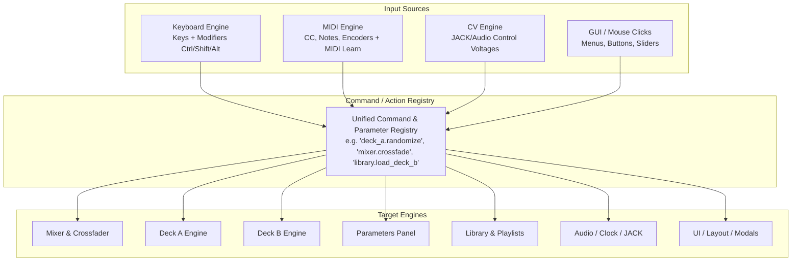

# Unified Control Mapping Architecture (MIDI / Keyboard / Mouse / CV)

> **Status**: Design specification. Phases 1-2 and 4 (command registry, device tagging, controller profiles, Perform-grid knob control, ring/LED feedback for the Twister) are implemented for MIDI; see section 6. The rest is roadmap.  
> **Inspiration**: [Mixxx DJ Software](https://mixxx.org/) Controller & Keyboard Mapping Architecture

---

## 1. Executive Summary & Vision

Liquid LSD is designed for high-energy, real-time live visual performance (VJing). While the existing application supports mouse manipulation, a subset of MIDI CC parameters, and CV modulation for select controls (like crossfading and play queue stepping), the long-term goal is **full control parity across all input modalities**:

1. **Hardware MIDI Controllers** (Faders, Knobs, Endless Encoders, Drum/Grid Pads, Pitch Wheels).
2. **Computer Keyboard** (Standard QWERTY keys, Modifiers: `Ctrl`, `Shift`, `Alt`/`Option`, `Meta`).
3. **Control Voltage (CV) / Audio Modulation** (LFOs, Audio Envelopes, JACK Audio/CV ports).
4. **Mouse & Touchpad** (GUI clicks, drags, context menus).

Any action that can be performed via a mouse click or menu selection should be exposable as a bindable **Command / Action Object** that can be assigned to keyboard shortcuts, MIDI controls (via MIDI Learn or config profiles), CV modulation, or combined macro triggers.

---

## 2. Architectural Model

```mermaid
graph TD
    subgraph Input Sources
        KB[Keyboard Engine<br/>Keys + Modifiers Ctrl/Shift/Alt]
        MIDI[MIDI Engine<br/>CC, Notes, Encoders + MIDI Learn]
        CV[CV Engine<br/>JACK/Audio Control Voltages]
        Mouse[GUI / Mouse Clicks<br/>Menus, Buttons, Sliders]
    end

    subgraph Command / Action Registry
        Reg[Unified Command & Parameter Registry<br/>e.g. 'deck_a.randomize', 'mixer.crossfade', 'library.load_deck_b']
    end

    subgraph Target Engines
        Mixer[Mixer & Crossfader]
        DeckA[Deck A Engine]
        DeckB[Deck B Engine]
        Grid[Parameters Panel]
        Lib[Library & Playlists]
        Audio[Audio / Clock / JACK]
        UI[UI / Layout / Modals]
    end

    KB --> Reg
    MIDI --> Reg
    CV --> Reg
    Mouse --> Reg

    Reg --> Mixer
    Reg --> DeckA
    Reg --> DeckB
    Reg --> Grid
    Reg --> Lib
    Reg --> Audio
    Reg --> UI
```

### 2.1 Decoupled Action / Command Registry
Rather than hardcoding keyboard handlers or mouse click callbacks inside ImGui rendering passes:
- Every action is registered with a unique path identifier (e.g. `[DeckA],randomize`, `[Mixer],crossfade`, `[Library],navigate_down`, `[Grid],trigger_cell_a`).
- Actions define their input characteristics:
  - **Trigger / Momentary**: Fires once on press, or stays active while held (e.g. stutter cut, blackout).
  - **Continuous / Scalar**: Accepts a normalized range $[0.0, 1.0]$ with optional custom scaling.
  - **Stepped / Relative**: Accepts relative delta ticks (e.g. $+1$ / $-1$ from rotary encoders or arrow keys).
  - **Toggle**: Flips boolean state on press.

### 2.2 Input Handling Behaviors
- **Stutter / Cut Mode (Momentary Gate)**: Pressing a key/pad instantly slams a parameter (e.g. Crossfader to Deck A, or Master Blackout); releasing the key restores the previous state.
- **Nudge / Step Mode**: Pressing a key increments or decrements a continuous value by a configurable delta (e.g. BPM $\pm 0.1$, Rotation Speed $\pm 5\%$).
- **Relative Encoders (Endless Knobs)**: Support for 2's complement and binary offset modes used on DJ hardware for smooth library scrolling and parameter tweaking without value jumps.
- **Hardware Feedback (MIDI Out / LED Matrix)**: Outputting state back to hardware (e.g. lighting Launchpad grid pads to match preset cell colors, flashing beat sync LEDs).

---

## 3. Comprehensive Inventory of User Actions

The following is an exhaustive breakdown of every user-accessible function, menu choice, button, and slider in Liquid LSD to be registered in the unified command table.

### 3.1 Global Transport, Projects & Application
| Action Identifier | Description | Default Target |
|---|---|---|
| `app.save_preset` | Save current preset / active state | File IO |
| `app.save_preset_as` | Open Save Preset dialog | Modal |
| `app.open_project` | Open project load dialog | File IO |
| `app.export_video` | Open Video Export modal | Modal |
| `app.toggle_settings` | Open / Close Settings panel | UI |
| `app.toggle_performance_stats` | Toggle FPS / CPU / GPU metrics overlay | UI |
| `app.toggle_fullscreen` | Toggle borderless fullscreen | Window |
| `app.undo` | Undo last preset / grid modification | State |
| `app.redo` | Redo last undone modification | State |
| `app.quit` | Safe application exit | Engine |

---

### 3.2 Mixer & Crossfader Section
| Action Identifier | Description | Input Mode |
|---|---|---|
| `mixer.crossfade` | Crossfader position (0.0 = A, 1.0 = B) | Continuous |
| `mixer.crossfade_snap_a` | Snap crossfader instantly to Deck A (0%) | Trigger |
| `mixer.crossfade_snap_b` | Snap crossfader instantly to Deck B (100%) | Trigger |
| `mixer.crossfade_snap_center` | Snap crossfader to exact Center (50%) | Trigger |
| `mixer.crossfade_stutter_a` | Hold to cut to Deck A; release to restore | Momentary |
| `mixer.crossfade_stutter_b` | Hold to cut to Deck B; release to restore | Momentary |
| `mixer.crossfade_nudge_left` | Nudge crossfader left by step | Step |
| `mixer.crossfade_nudge_right` | Nudge crossfader right by step | Step |
| `mixer.auto_crossfade_trigger`| Start automated crossfade transition | Trigger |
| `mixer.auto_crossfade_speed` | Adjust auto-crossfade duration (beats/sec) | Continuous / Step |
| `mixer.curve_select` | Cycle / select transition blend curve | Stepped |
| `mixer.master_brightness` | Master opacity / dimmer level | Continuous |
| `mixer.blackout` | Blackout all video output (momentary/toggle) | Momentary / Toggle |
| `mixer.whiteout_strobe` | Flash master output to pure white | Momentary |
| `mixer.queue_prev` | Play previous item in play queue | Trigger |
| `mixer.queue_next` | Play next item in play queue | Trigger |
| `fx.queue_next` / `fx.queue_prev` | Step the A/B FX queue (target deck follows the crossfader) | Trigger |
| `fx.bg_queue_next` / `fx.bg_queue_prev` | Step the background FX queue | Trigger |
| `mixer.toggle_auto_vj` | Enable / disable Auto-VJ automated setlist playback | Toggle |

---

### 3.3 Deck Controls (Independent for `deck_a` and `deck_b`)
Replace `deck_x` with `deck_a` or `deck_b` (or `deck_selected`):

| Action Identifier | Description | Input Mode |
|---|---|---|
| `deck_x.load_active_preset` | Load currently selected library preset into deck | Trigger |
| `deck_x.clear_deck` | Reset deck to blank default state | Trigger |
| `deck_x.reload_preset` | Discard unsaved deck changes and reload preset | Trigger |
| `deck_x.save_to_preset` | Save current deck state as a preset | Trigger |
| `deck_x.mute` | Mute / blank deck output | Toggle |
| `deck_x.solo` | Solo deck (preview directly to master) | Toggle |
| `deck_x.randomize` | Randomize all unlocked parameters | Trigger |
| `deck_x.mutate` | Mutate / drift unlocked parameters slightly | Trigger |
| `deck_x.lock_all` | Lock all parameters against mutation | Trigger |
| `deck_x.unlock_all` | Unlock all parameters | Trigger |
| `deck_x.toggle_param_lock` | Toggle lock for specific parameter | Toggle |

---

### 3.4 Mandala & Shader Synthesis Parameters (Per Deck)
| Action Identifier | Description | Input Mode |
|---|---|---|
| `deck_x.geometry.shape` | Select / cycle geometric shape mode | Stepped / Continuous |
| `deck_x.geometry.symmetry` | Adjust petal count / radial symmetry order | Continuous / Step |
| `deck_x.geometry.zoom` | Adjust camera zoom / scale | Continuous |
| `deck_x.geometry.rotation` | Adjust static rotation angle | Continuous |
| `deck_x.geometry.spin_speed` | Adjust dynamic rotation speed & direction | Continuous |
| `deck_x.geometry.layer_count` | Adjust number of nested visual layers | Continuous / Step |
| `deck_x.geometry.blend_mode` | Cycle layer blend modes (Add, Multiply, Screen) | Stepped |
| `deck_x.color.palette_select` | Select color palette (previous/next or direct) | Stepped / Index |
| `deck_x.color.hue_shift` | Hue rotation fader ($0^\circ \dots 360^\circ$) | Continuous |
| `deck_x.color.saturation` | Saturation boost / desaturate fader | Continuous |
| `deck_x.color.brightness` | Brightness / level fader | Continuous |
| `deck_x.color.contrast` | Contrast curve fader | Continuous |
| `deck_x.color.invert` | Invert colors toggle | Toggle |
| `deck_x.color.cycle_speed` | Palette color cycling speed | Continuous |
| `deck_x.mod.lfo1_rate` | LFO 1 frequency / beat division | Continuous / Stepped |
| `deck_x.mod.lfo1_depth` | LFO 1 modulation depth | Continuous |
| `deck_x.mod.lfo1_shape` | LFO 1 waveform (Sine, Tri, Saw, Square, S&H) | Stepped |
| `deck_x.mod.lfo2_rate` | LFO 2 frequency / beat division | Continuous / Stepped |
| `deck_x.mod.lfo2_depth` | LFO 2 modulation depth | Continuous |
| `deck_x.mod.trigger_manual` | Manual trigger pulse for trigger modulator | Trigger |

---

### 3.5 Parameters & Performance Matrix
| Action Identifier | Description | Input Mode |
|---|---|---|
| `grid.trigger_cell_a(x, y)` | Load preset at grid $(x, y)$ into Deck A | Trigger |
| `grid.trigger_cell_b(x, y)` | Load preset at grid $(x, y)$ into Deck B | Trigger |
| `grid.preview_cell(x, y)` | Preview preset at grid $(x, y)$ in monitor | Trigger |
| `grid.clear_cell(x, y)` | Clear / delete preset at grid cell $(x, y)$ | Trigger |
| `grid.edit_cell_notes(x, y)` | Open Note Editor modal for cell $(x, y)$ | Trigger |
| `grid.tab_select(index)` | Select parameters tab / bank $(1 \dots N)$ | Index |
| `grid.tab_next` | Switch to next grid tab | Trigger |
| `grid.tab_prev` | Switch to previous grid tab | Trigger |
| `grid.tab_add` | Create new preset tab | Trigger |
| `grid.tab_rename` | Rename active preset tab | Trigger |

---

### 3.6 Library & Asset Browser
| Action Identifier | Description | Input Mode |
|---|---|---|
| `library.nav_up` | Move selection cursor up in library tree/list | Step |
| `library.nav_down` | Move selection cursor down in library tree/list | Step |
| `library.nav_page_up` | Move selection up by page | Step |
| `library.nav_page_down` | Move selection down by page | Step |
| `library.expand_collapse` | Expand / collapse selected folder | Toggle |
| `library.focus_search` | Focus search / filter text input | Trigger |
| `library.clear_search` | Clear search query and reset view | Trigger |
| `library.filter_select` | Cycle / select category filter tab | Stepped |
| `library.load_selected_a` | Load selected preset into Deck A | Trigger |
| `library.load_selected_b` | Load selected preset into Deck B | Trigger |
| `library.preview_selected` | Preview selected preset | Trigger |
| `library.enqueue_end` | Append selected preset to Play Queue | Trigger |
| `library.enqueue_next` | Insert selected preset as next item in Play Queue | Trigger |
| `library.toggle_favorite` | Toggle favorite / star on selected preset | Toggle |
| `library.rescan` | Rescan / refresh library directory on disk | Trigger |
| `library.delete_selected` | Delete selected preset from disk | Trigger |

---

### 3.7 Audio Engine, Clock & BPM
| Action Identifier | Description | Input Mode |
|---|---|---|
| `clock.tap_tempo` | Tap tempo button | Trigger |
| `clock.bpm_adjust` | Continuous BPM tempo fader | Continuous |
| `clock.bpm_nudge_up` | Nudge tempo up ($+0.1$ or $+1.0$ BPM) | Step |
| `clock.bpm_nudge_down` | Nudge tempo down ($-0.1$ or $-1.0$ BPM) | Step |
| `clock.bpm_half` | Halve BPM ($/2$) | Trigger |
| `clock.bpm_double` | Double BPM ($\times 2$) | Trigger |
| `clock.sync_toggle` | Toggle external sync (JACK / MIDI / Link) | Toggle |
| `audio.input_gain` | Master audio input gain slider | Continuous |
| `audio.sensitivity` | Spectral flux / onset detection sensitivity | Continuous |
| `audio.band_gain_low` | Low frequency / bass band sensitivity | Continuous |
| `audio.band_gain_mid` | Mid frequency band sensitivity | Continuous |
| `audio.band_gain_high` | High frequency / treble band sensitivity | Continuous |
| `audio.engine_toggle` | Start / pause / restart audio subsystem | Toggle |

---

### 3.8 UI & Workspace Layout
| Action Identifier | Description | Input Mode |
|---|---|---|
| `ui.toggle_left_panel` | Toggle Library / Browser panel visibility | Toggle |
| `ui.toggle_right_panel` | Toggle Settings / Audio / Oscilloscope panel | Toggle |
| `ui.toggle_bottom_panel` | Toggle Parameters panel visibility | Toggle |
| `ui.cycle_theme` | Cycle UI theme (Dark, Cyberpunk, High Contrast) | Stepped |
| `ui.reset_layout` | Reset dockers and splitters to default | Trigger |

---

## 4. Hardware Controller & User Mapping Workflow

Inspired by Mixxx's mapping system, Liquid LSD can implement a tiered mapping system:

### 4.1 Global Mapping Manager & Table GUI
- A unified **Mapping Settings Panel** presenting the complete action inventory in a searchable, filterable table.
- Each row lists:
  - `Action Name & Description`
  - `Keyboard Binding` (e.g. `Ctrl + Shift + A`, `Space`, `Up Arrow`)
  - `MIDI Binding` (e.g. `Ch 1 - CC 14`, `Ch 1 - Note C3`)
  - `CV Source Binding` (e.g. `JACK In 1`, `LFO 1`)
  - `Mode` (Momentary, Toggle, Continuous, Stutter)

### 4.2 Interactive "Learn" Overlay & Context Menus
- Right-clicking any button, slider, or grid pad in the GUI reveals:
  - **MIDI Learn**: Listens for the next incoming MIDI CC or Note event and binds it immediately.
  - **Assign Key**: Prompts for a keypress (with automatic capture of `Ctrl`, `Shift`, `Alt`).
  - **Bind CV**: Drops down available internal CV modulators and external JACK CV ports.

### 4.3 Hardware Controller Preset Files (JSON / YAML)
Community and out-of-the-box hardware profiles stored under `library/mappings/`:
- `library/mappings/controllers/novation_launchpad_mini.json` (Grid matrix mapping)
- `library/mappings/controllers/akai_apc40_mk2.json` (Faders, knobs, crossfader, clip launch)
- `library/mappings/controllers/pioneer_ddj_400.json` (DJ style transport, jog/rotary, crossfader)
- `library/mappings/keyboard/qwerty_default.json` (Standard keyboard layout with stutter keys)

---

## 5. Implementation Phasing Strategy

1. **Phase 1: Core Action Registry (`CommandRegistry`)**:
   - Refactor existing parameter paths and button callbacks into registered `Command` instances with metadata (ID, category, input type, description).
2. **Phase 2: Keyboard Shortcut Engine**:
   - Intercept GLFW key events with modifier state (`GLFW_MOD_CONTROL`, `GLFW_MOD_SHIFT`, `GLFW_MOD_ALT`).
   - Dispatch to `CommandRegistry` for triggers, toggles, and momentary hold/release states (e.g., crossfader stutter).
3. **Phase 3: Unified MIDI Mapping & MIDI Learn**:
   - Generalize `MidiMappingManager` to bind to any registered `Command` (not just continuous float parameters).
   - Support Note On/Off, relative encoders, and momentary buttons.
4. **Phase 4: Mapping Configuration UI & Profile Exporter**:
   - Build the GUI mapping table and right-click "Learn" modals in ImGui.
   - Support loading/saving controller presets to `library/mappings/`.

---

## 6. Implemented So Far (2026-10-01)

Package `llm.slop.liquidlsd.control`; tests in `src/test/kotlin/.../control/` and `midi/GlobalCommandDispatchTest.kt`.

### 6.1 Command registry
- `CommandRegistry` holds `Command(id, kind, category, description, handler)`. Kinds: `TRIGGER`, `TOGGLE` (both fire on the rising edge only), `MOMENTARY` (both edges), `SCALAR` (0..1), `RELATIVE` (signed steps). Inputs are `CommandInput.Press/Value/Delta`; an input that doesn't fit the command's kind is rejected.
- Edge detection lives in the registry (per command id), not in each caller.
- Aliases map legacy identifiers to command ids. The ten `Global/*` mapping paths are aliases of the commands in `GlobalCommands` (`mixer.queue_next`, `mixer.queue_prev`, `mixer.bg_queue_next/prev`, `mixer.trans_queue_next/prev`, `clock.tap_tempo`, `mixer.auto_crossfade_trigger`, `mixer.crossfade_snap_a/b`). The four `fx.*` queue commands (`fx.queue_next/prev`, `fx.bg_queue_next/prev`) have no legacy path and are not bound in the built-in Twister profile (no free input); bind them in a user profile. Existing `library/midi/*.json` profiles load unchanged.
- `MidiMappingManager.processGlobalMidiEvents` runs `Global/*` mappings through `MidiMappingManager.commands`. Handlers get a `CommandContext` (mixer, tap callback, queue deltas) and run on the render thread only; the registry is not thread-safe.
- Parameter and `Macro/...` bindings are not on the registry yet.

### 6.2 Device tagging
`MidiEvent.deviceId` is the javax.sound.midi device name of the port that produced the event ("" for synthetic events). On connect, `MidiEngine` logs which controller profile (if any) matches the device.

### 6.3 Controller profiles
- A profile is JSON: `id`, `name`, `description`, `match` (case-insensitive substrings of the device name), `banks`, `inputs`, `bindings`, `bankBindings`.
- Built-ins live in `src/main/resources/controllers/` and are listed in `ControllerProfileStore.BUILT_IN_NAMES`; user profiles in `library/controllers/*.json`. A user profile with the same `id` replaces the built-in, and user profiles win when two match one device. Profiles that fail to parse or validate are skipped with an error in the log.
- `banks.pages` lists the app page to show when each hardware bank becomes active (index = 0-based bank; `perform.<page id>`: the built-ins are `decks`, `master`, `ab`, `bgpv`, `mixer`, plus any page in `library/perform_pages/`; the shipped Twister profile uses `ab`, `bgpv`, `mixer`, `master`). `inputs`: each entry is one input or a group. Group members come from `ccs` or `cc until cc + count` and are named `<id>.<n>` (1-based). `bankStride` adds `bank * bankStride` to the CC so a logical input keeps one id on every hardware bank. An `ENCODER` can carry `press: {channel}` (same CCs on another channel), exposed as `<id>.<n>.press`. `kind` is `ENCODER`, `BUTTON`, `FADER` or `MODIFIER` (a held button that selects alternate bindings). Encoders also take `mode` (`ABSOLUTE`, `RELATIVE_BINARY_OFFSET`, `RELATIVE_SIGNED_BIT`, `RELATIVE_TWOS_COMP`), `step` (fraction of a control's range per tick, default 1/127) and `accel` (maximum speed-up, 1 disables).
- `banks.switch` describes the device's bank buttons (`CC = cc + bankIndex`; a non-zero value means that bank is now active).
- Binding keys are an input id with optional held-modifier prefixes (`shift+knob.3.press`); `bankBindings` (1-based bank) override `bindings`. In the last part of a key `*` matches a group index and `{n}` in the value is replaced by it (`"knob.*": "knob.{n}"`). `CompiledController.bindingFor(inputId, held, bank)` picks the most specific binding: more modifiers beat fewer, then a bank binding beats a global one.
- `ControllerProfile.compile()` builds a `(type, channel, cc) -> ResolvedInput(inputId, kind, bank, mode)` table and a list of structural problems (CC collisions, out-of-range values, duplicate ids, bindings naming unknown inputs or non-modifier prefixes). `unknownCommands(registry)` lists binding targets that aren't registered.
- Bindings, modifiers, banks and encoder handling are live (6.5). Navigation/browse commands are live (6.7). Not implemented yet: response curves. See `.planning/midi-controller-plan.md`.

### 6.4 Built-in profile
Banks select Perform pages (`banks.pages`: `ab`, `bgpv`, `mixer`, `master`). Side buttons `side.1..3` (CC 8, 11, 13) are the context-dependent navigation buttons; shift is CC 10.
`midi-fighter-twister`: 64 encoders (CC 0..63 on ch1 = knob + 16 * bank), encoder switches on ch2 with the same CCs, 4 side buttons per bank on ch4 (CC 8, 10, 11, 13, +4 per bank), bank buttons on ch4 CC 0..3. Measured on hardware.

### 6.5 Controller runtime and the Perform grid (phase 2)
- `ControllerManager` creates one `ControllerRuntime` per device the first time it sends a message and its name matches a profile. `MidiMappingManager.processGlobalMidiEvents` offers each event to it before the legacy `Global/*` and parameter bindings; a runtime consumes an event only if the profile binds that input, and a learned mapping on the exact channel/CC takes precedence over the profile, except while `NavSurface.browsing` is true (the profile then gets the event first).
- The runtime tracks the active bank (from the bank buttons, or any bank-aware input), held modifiers, and per-encoder state. Encoder messages become signed ticks (relative modes decode directly; `ABSOLUTE` is the change since the last value, so the first message only locates the knob), scaled by `step` and a speed-based boost (`accel`, full at <= 8 ms between ticks, none at >= 60 ms), then sent as `CommandInput.Delta`. A button's release goes to the command that received its press.
- `KnobCommands` registers `knob.1..16` (RELATIVE), `knob.<n>.press` and `knob.<n>.press_alt` (MOMENTARY). It tracks which switches are held (the Twister sends the same turn messages either way): turning while held is fine (x0.1) and cancels the tap; a tap runs `KnobSurface.primary` (`press`) or `secondary` (`press_alt`).
- `KnobSurface` (render thread) is implemented by `ui/PerformSurface`. Its page is `PerformPages.resolve`: `PerfRows.visibleRowsForTab` (the same rows `PerformanceMatrixPanel` draws, now in a shared object) through `PerfKnobResolver`, flattened row-major into 16 slots. Actions: turn adds to `MacroControl.value`; primary on an FX slot cell = `FxOps.setSlotEnabled`, on a parameter = reset to default, on a label knob = reset to 0.5; secondary on a slot cell = `FxMacroSync.focusSlot` (or leave focus when it is knob 1 of a focused row), on a parameter = `FxMacroSync.stepParamPage`; `showPage` sets the matrix tab.

### 6.6 Ring and LED feedback (phase 4)
- Profile `output.knobs`: `input` (the encoder group, e.g. `knob`), `ringChannel` (default: the encoder's channel), `colorChannel` (null = no LEDs) and `color`, a `HueWheel` (`min`/`max` value range, `off`, `white`, `hueAtMin`, `degreesPerStep`; defaults are the Twister's wheel: blue = 1, hue decreasing 2.88 degrees per step). The ring is set by sending the encoder's own CC on `ringChannel`; the LED by sending the same CC number on `colorChannel`.
- `KnobLightSource.knobLights()` (implemented by `ui/PerformSurface`) returns 16 `KnobLight`s: ring value, LED colour (`PerformPages.ledColor`: the row accent, except `PerformanceColors.LED_MASTER`/`LED_GLOBAL`), `lit`. `ControllerFeedback.update(lights, activeBank, nowMs)` expands them to the encoder CCs of the group and writes only changed values, for the active bank only (all banks while it is unknown; the whole new bank when it changes, since the Twister showed its stored colours on banks that were not on screen). `resync()` forces a full rewrite. Each bank's own CC numbers are used (CC = knob + stride * bank; verified with amidi on the Twister: CC 16 is live on bank 2, CC 0 is not). `output.trace` (or env `LSD_MIDI_TRACE=1`) logs every feedback message (`TracingSink`), bank change and encoder message at INFO.
- `MidiOutputPorts.openFor(name, minIntervalMs)` writes through a `CcQueue` (one pending value per channel/CC, so a slow device never accumulates stale values) from a daemon thread that keeps at least `output.minIntervalMs` (default 2) between messages, because the Twister drops bursts. It logs send time and backlog every 5 s (INFO when a send takes over 5 ms or the backlog exceeds 40).
- `ControllerManager.updateFeedback` runs once per frame from `UIManager.render`. Once a second it scans `MidiEngine.getConnectedDeviceNames()`: matching devices get a `ControllerFeedback` over `MidiOutputPorts.openFor(name)` (an output port with the same device name, written from a daemon thread); devices that left or whose sink is unhealthy are dropped, and a failed open is retried after 10 s.

### 6.7 Navigation (phase 3)
`NavSurface` (on `CommandContext`, like `KnobSurface`) gets `nav.button.1..3` / `.alt` from `NavCommands` and the knob 16 cursor (`KnobCommands.BROWSE_KNOB`) from `KnobCommands` while `browsing`; with `browseRowLive` (the picker, whose Deep Edit page is the browsed row alone) knobs 1-4 also pass through to `KnobSurface`, and `PerformSurface.knobLights` darkens everything else. The UI implementation is `ui/NavigationSurface.kt`; it dispatches on the current view (Library FULL vs Perform/Edit) and calls `LibraryNavigation` (tab, list, cursor, accept, enqueue) and `BackNavigation` (the Esc stack). The user-facing layout (which button does what in the Perform, picker and Library contexts, and a worked "load an effect on Deck A" example) is in the user guide, `performance_controls.md`, section "Controller Profiles: Midi Fighter Twister".

The picker context: `NavigationSurface.inPicker` = Edit view and `BrowserPane.hosted() != null` (the target drawn in the last 300 ms). Cursor API: `LibraryNavigation.step/stepPane/accept` (the same functions the Library uses, following `LibraryPanel.navMode`) and the hosted `ApplyTarget.clear`. Opening uses `PerformSurface.lastTouchedKnob` to find the row.

### 6.8 Profile store writes and the profile UI (phase 5, slice 1)
`ControllerProfileStore` can write: `copyBuiltInToUser(id)` (refuses when a user file with that id exists), `saveUser(profile)` (returns `compile().problems` and writes nothing when invalid), `deleteUser(id)` (locates the file by profile id). `sourceOf(id)` reports BUILT_IN / USER / USER_OVERRIDE and `rejected()` lists user files that failed to parse or validate, with the reasons. **Schema version:** `ControllerProfile.version` (default 1; a missing field means 1; `CURRENT_SCHEMA_VERSION` is what this build reads and writes, and every write stamps it). `version < current` runs `ControllerProfile.migrate` (identity today; add one step per bump). `version > current` loads best-effort (unknown keys are ignored), appears in `warnings()`, and `saveUser` refuses to overwrite that file so unknown fields are never silently dropped. Bump the version only for changes an older build would misread; additive optional fields do not need a bump. The cache is one immutable snapshot, dropped by `reload()`; after any change call `ControllerManager.reset()` so runtimes pick up the new profile. The UI is `MidiPreferencesPanel.drawControllerProfiles`. Open: in-app binding editor, learn-into-profile, see `.planning/midi-phase5-profile-ui-plan.md`.

### 6.9 Binding editor (phase 5, slice 2)
`ProfileBindingEdit` holds the pure edits (`set`, `remove`, `key`, `fits`, `commandFits`); `CompiledController.inputKinds` lists every bindable input id with its kind. `MidiPreferencesPanel.drawBindingEditor` writes through `ControllerProfileStore.saveUser` and schedules `ControllerManager.reset()` 600 ms after the last successful edit. Only global `bindings` are editable; `bankBindings` and learn-into-profile (`MidiLearnTarget.ProfileCommand`) are open.

### 6.10 Learn into a profile (phase 5, slice 3)
`MidiLearnTarget.ProfileCommand(profileId, commandId, modifiers)` is handled by `MidiMappingManager.learnIntoProfile`, which calls `ProfileBindingEdit.learn(compiled, event, commandId, modifiers)`: a resolved input gets a key (modifiers sorted + input id), an unresolved one gets a new `InputDef` (`<type>-<channel>-<index>`, kind guessed from the message). Result text goes to `profileLearnMessage`. Open: per-bank bindings.
