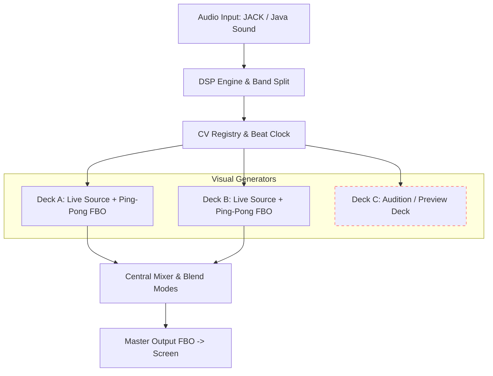

# Core Concepts & Visual Architecture

Liquid LSD is structured around modular visual sources, a multi-deck rendering engine, ping-pong feedback loops, and a central visual mixer.

---

## High-Level Rendering Architecture

---

## Visual Generators (Visual Sources)

Every deck runs a pluggable **Visual Source** that generates procedural geometry or raymarched shaders. Liquid LSD includes 10 built-in engines along with support for dynamic GLSL shaders.

### 1. Mandala Synthesis Engine (`Mandala.kt`)
The core procedural geometry generator:
- **Lobe Count (Petals)**: Controls rotational symmetry (how many repeating arms are generated).
- **Mandala Ratios**: Accesses a curated library of ~300 ratio presets determining mathematical harmonic intersections.
- **3D Projections**:
  - *Spherical Mapping*: Extrudes 2D curves onto a 3D sphere via longitude/latitude angles.
  - *Polyhedral Reflections*: Replicates curves across Cubic/Octahedral (8 instances) or Tetrahedral (4 instances) reflection groups.
  - *Coordinate Permutation*: Projects curves onto XY, YZ, and ZX planes simultaneously.
  - *Perspective View*: Seamlessly transition from orthographic (`3D Persp` = 0) to immersive perspective projection (`3D Persp` = 1).

### 2. KIFS Fractal Engine (`Kifs.kt`)
Kaleidoscopic Iterated Function System generating complex fractal geometry using CPU-side mathematical folding:
- **Shape Morph**: Smoothly interpolates geometry across 4 polyhedral symmetry modes:
  1. *Cube Symmetry* (0.0 – 1.0)
  2. *Tetrahedron Symmetry* (1.0 – 2.0)
  3. *Dodecahedron / Icosahedron Symmetry* (2.0 – 3.0)
  4. *Soccer Ball Symmetry* (3.0 – 4.0)
- **Fold Angle Offsets**: Real-time X/Y/Z fold angle offsets that can be driven by LFOs or audio CVs.

### 3. Procedural Shader Sources
Built-in raymarched and procedural shaders:
- **Gyroid**: Dynamic 3D triply periodic minimal surface.
- **Mandelbulb & Mandelbox**: 3D hyper-complex fractal raymarchers.
- **Chladni**: Acoustic vibration pattern generator.
- **Pseudo-Kleinian**: Kleinian group fractal limit sets.
- **Dynamic Spiral**: Multi-point spiral curve generator.

---

## Framebuffer Feedback Loops (Ping-Pong FBOs)

Each deck incorporates an independent dual Framebuffer Object (FBO) feedback loop:
1. The raw visual source renders into `cleanFBO`.
2. The previous frame's feedback texture is combined with `cleanFBO` inside `feedback.frag`.
3. Feedback transformation uniforms (**Decay**, **Gain**, **Zoom**, **Rotate**, **Hue Shift**, **Blur**, **Chroma Offset**) shift and decay the image continuously.
4. Read and write feedback buffers swap (ping-pong) each frame, creating fluid liquid trails, organic motion, and video-feedback zoom effects.

---

## Deck Architecture: Live Decks A/B vs. Preview Deck C

Liquid LSD features a three-deck architecture tailored for live VJ performance:

### Deck A & Deck B (Live Performance Decks)
Decks A and B drive the live master output. They feed directly into the central Mixer.

### Deck C (Preview / Audition Deck)
Deck C runs the complete rendering pipeline (Visual Source + Ping-Pong Feedback), but is **strictly excluded from the Mixer master output**. 
- **Auditioning Patches**: Performers can load, build, edit, and preview new patches on Deck C while Decks A and B continue delivering live visuals to the audience screen.
- **Safe Preparation**: Test complex CV routings or shader parameters safely on Deck C before loading them onto live Decks A or B.

---

## Central Mixer & Blending Modes

The central Mixer blends the outputs of Deck A and Deck B to form the master video signal.

### Blending Equations
- **`ADD`** (Additive): Sums RGB values; ideal for dark background contrast.
- **`SCREEN`**: Lightens overlapping areas while preserving dark detail.
- **`MULT`** (Multiply): Multiplies RGB values; creates subtractive stencil masks.
- **`MAX`** (Lighten): Compares A and B per-pixel and selects the brightest color.
- **`XFADE`** (Crossfade): Standard linear interpolation between Deck A and Deck B.

### Crossfader Modulation
The `crossfade` slider interpolates between Deck A (0.0) and Deck B (1.0). Like all parameters in Liquid LSD, `crossfade` can be modulated by CV sources (e.g. an LFO or `audio_bass`) to automate deck switching in tight sync with the music.

---

## Render Resolution & Video Output Scaling

Liquid LSD provides granular control over internal render resolution and external display output scaling under **Settings -> Video & Display**:

### 1. Resolution Presets & Custom Dimensions
- **16:9 Presets**: 1080p ($1920 \times 1080$), 720p ($1280 \times 720$), 540p ($960 \times 540$), 1440p ($2560 \times 1440$), 4K UHD ($3840 \times 2160$).
- **4:3 Presets**: UXGA ($1600 \times 1200$), XGA ($1024 \times 768$), SVGA ($800 \times 600$) for club projectors and vintage CRT displays.
- **1:1 Square Presets**: $1080 \times 1080$, $800 \times 800$, $600 \times 600$ for modular stage LED walls and livestreams.
- **Custom**: User-specified width and height (from $128 \times 128$ to $7680 \times 4320$).

### 2. GPU Performance Scaling
Running complex distance-field raymarchers (e.g., KIFS, Mandelbulb, Pseudo-Kleinian) across three decks simultaneously evaluates millions of pixels per frame. Switching from 1080p to 720p or 540p reduces GPU load by 55%–75%, allowing smooth 60 FPS performance on laptops and integrated GPUs.

### 3. Display Scaling Modes
When the internal render aspect ratio differs from the connected display or secondary projector:
- **Fit (Letterbox / Pillarbox)**: Maintains exact render aspect ratio with black border bars.
- **Fill (Crop)**: Centers and crops edges to completely fill the screen without borders.
- **Stretch**: Stretches the image to fill the output screen.

