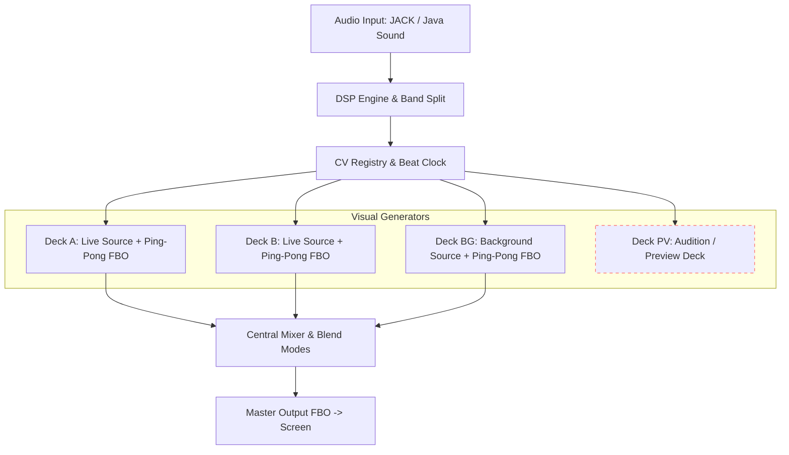

# Core Concepts & Visual Architecture

Liquid LSD is a multi-deck visual instrument. It pairs procedural geometry and GLSL shaders with an analog-style Control Voltage (CV) matrix, dedicated feedback loops, and a central performance mixer[cite: 1, 3].

---

## Signal Flow

Audio enters the DSP engine, generates synchronized CV modulation, and drives each visual generator. The outputs pass through independent FX and feedback stages before blending in the central mixer. Optionally, video from other apps can be used as an input, using Spout/PipeWire/Syphon (depending on your OS). Further, any of the four decks and the Master ouput can be used as an input in other VJ apps, again using Spout/PipeWire/Syphon. Liquid LSD can take an input from Ableton Link so BPM is in sync with your other apps. Or, Liquid LSD can use its sound analyser to find the beat, and output that as an Ableton Link.

## High-Level Rendering Architecture



---

## Here is the finalized **`user_guide/concepts.md`** with those three clarifications dialed in:

Markdown

```
# Core Concepts & Visual Architecture

Liquid LSD is a multi-deck visual instrument. It pairs procedural geometry and GLSL shaders with an analog-style Control Voltage (CV) matrix, dedicated feedback loops, and a central performance mixer[cite: 1, 3].

---

## Signal Flow

Audio enters the DSP engine, generates synchronized CV modulation, and drives each visual generator. Visuals then run through two post-processing FX slots and an internal ping-pong feedback stage before blending in the master mixer:

```mermaidgraph TD    Audio[Audio Input: JACK / Java Sound] --> DSP[DSP Engine & Beat Clock]    DSP --> CV[CV Modulation Matrix]        subgraph Decks [Visual Generators + Dual ISF FX]        DeckA[Deck A: Live Source + Ping-Pong FBO]        DeckB[Deck B: Live Source + Ping-Pong FBO]        DeckBG[Deck BG: Background Source + Ping-Pong FBO]        DeckPV[Deck PV: Audition / Preview Deck]    end        CV --> DeckA    CV --> DeckB    CV --> DeckBG    CV --> DeckPV        DeckBG --> Composite[Background Composite]    DeckA --> Mixer[Central Mixer & Blend Modes]    DeckB --> Mixer    Mixer --> Composite    Composite --> Master[Master Output -> Screen / Projector]        style DeckPV stroke:#f66,stroke-dasharray: 5 5
```

## The Four Decks

Liquid LSD uses a dedicated four-deck layout designed for live stage performance:

- **Deck A & Deck B (Live Performance)**: The primary stage decks routed directly into the crossfader and blend modes.

- **Deck BG (Background Layer)**: Renders directly behind Decks A and B. Ideal for subtle textures, dark ambient backdrops, or color fields when running transparent foregrounds.

- **Deck PV (Preview / Audition)**: Runs an identical, fully independent rendering and feedback chain, but **never routes to the master output**. Audition presets, sketch out new looks, and route CV modulation in real time on your preview monitor before going live.

## Visual Generators

Every deck hosts an independent visual engine. You can load native procedural sources or dynamic GLSL/ISF shaders:

- **Mandala Synthesis Engine**: Procedural geometry generator with ~300 curated harmonic ratios. Built-in size normalization ensures the outer boundaries stay stable and fill your vertical frame cleanly, no matter how wild your LFO modulation gets. Supports spherical wrapping, cubic cages, and continuous orthographic-to-perspective projection.

- **Icosa-Dodeca**: A real-time 3D polyhedral raymarcher. Seamlessly morphs across Platonic solids, Archimedean bridges, and Kepler-Poinsot star polyhedra:

- `0.00`: Icosahedron (20 triangular faces)

- `0.125`: Icosidodecahedron (20 triangles + 12 pentagons)

- `0.25`: Dodecahedron (12 pentagonal faces)

- `0.50`: Great Stellated Dodecahedron (12 5-pointed star pyramids)

- `0.75`: Great Icosahedron (20 3-sided star spikes)

- Tip: Set `Opacity` to `0.6–0.8` to enable translucent crystal reveals of internal facets.

- **Procedural Engines**: Built-in math generators including **Attractor Feedback** (strange attractor log-density trails), **Dynamic Spiral** (radial curves), **Gyroid** (triply periodic minimal surfaces), and **Chladni** (acoustic nodal vibration plates).

### The Shader Picker

Pressing the shader selector opens a universal, searchable library modal:

- **Search & Filter**: Type any keyword, tag, or author to filter hundreds of ISF and GLSL shaders instantly.

- **Context-Sensitive**: Automatically filters categories based on whether you are assigning a generator, an FX slot, or a mixer transition.

- **Detach / None**: Quickly unloads the active shader with a single click.

## Dual ISF FX Slots

Each deck features two chained post-processing slots positioned directly before the feedback loop:

- **Slot 1 (Color & Signal)**: Color grading, inversions, posterization, luma keying, and digital degradation.

- **Slot 2 (Spatial & Distortion)**: 3D plane elevation, multi-pass bloom, chromatic aberration, digital glitch, and spatial folding.

- **Zero Overhead Bypass**: Each slot supports an independent bypass toggle and continuous Dry/Wet modulation. Bypassed or zero-wet slots execute with zero GPU draw call overhead.

## Universal View & 3D Stage

Every deck has a universal **View** tab to position, scale, and project visuals before they hit the feedback loop:

- **Universal Framing (2D & 3D)**:

- **Zoom**: Continuous camera and scale control ($0.1\times$ to $5.0\times$). Calibrated so `1.0` fills the vertical frame height exactly.

- **Rotate Z (Roll)**: Clockwise/counter-clockwise in-plane roll with aspect-ratio correction.

- **3D Display Modes** (Converts flat 2D sources into 3D geometry):

- **2D Flat (`0.0`)**: Direct widescreen rendering with maximum efficiency.

- **Tri-Axial Orthogonal (`1.0`)**: Replicates the source across intersecting $XY$, $YZ$, and $ZX$ planes to create an armillary gyroscope.

- **Cube Cage (`2.0`)**: Maps visuals to a 6-sided cubic box. Expanding `Separation` pushes faces outward into an exploding cube array.

- **Hex-Planar (`3.0`)**: 6 intersecting tetrahedral planes forming an open rhombic dodecahedron.

- **Tetrahedral Kaleidoscope (`4.0`)**: 24-chamber space-folding kaleidoscope with continuous reflection mirrors.

## Framebuffer Feedback Loops (Ping-Pong)

Each deck includes an independent dual-FBO ping-pong feedback loop:

1. The generator (plus 3D View and FX) draws to an internal buffer (`cleanFBO`).

2. The buffer blends with the previous frame inside `feedback.frag`.

3. Real-time parameters (**Decay, Gain, Zoom, Rotate, Hue Shift, Blur, Chroma Offset**) transform and decay the accumulated trails.

4. The read and write buffers swap every frame, producing fluid liquid trails and infinite video-echo tunnels.

## Master Mixer & Clock Sync

### Blend Modes & Transitions

The mixer combines Deck A and Deck B using either standard mathematical blend modes (**ADD**, **SCREEN**, **MULT**, **MAX**, **XFADE**) or custom ISF transition shaders (**Wipes**, **Glitch**, **Luma Dissolve**, **Zoom Fade**).

- Left-clicking the master monitor preview jumps directly to the **MIX** tab in the grid.

### Crossfader Takeover & Auto-Centering

- **Automated CV Routing**: Drive the crossfader with LFOs, audio bass triggers, or beat clocks for automated scene switching.

- **Manual Takeover**: Grabbing the crossfader slider with your mouse or a mapped MIDI controller immediately disarms Auto-VJ and mutes non-MIDI CV modulators, giving you clean 1:1 manual authority.

- **Auto-Centering**: Unmuting any CV modulator on the crossfader automatically resets its base value to `0.0`, ensuring modulators oscillate symmetrically between decks without clipping against an old manual fader position.

### Clock Synchronization (Ableton Link)

Liquid LSD tracks musical timing through three switchable clock modes:

- **Ableton Link**: Peer-to-peer wireless beat, phase, and tempo sync across your local network with Ableton Live, Bitwig, Traktor, Serato, or other VJ rigs.

- **Audio Beat Tracker**: Automatic onset detection and tempo tracking via incoming audio FFT.

- **Manual Flywheel**: Internal tempo with manual tap tempo cadence.

## Output Scaling & Global Shortcuts

- **GPU Performance Scaling**: Running complex shaders across all active decks evaluates millions of pixels per frame. Lower your internal render resolution under **Settings -> Video & Display** (e.g., from 1080p to 720p or 540p) to reduce GPU overhead by up to 75% on laptops and integrated GPUs.

- **Fit / Fill / Stretch**: Adjust output aspect ratios when sending video to non-standard LED walls or vintage 4:3 club projectors.

- **`B`**: Toggle background video rendering behind the UI.

- **`F`**: Toggle fullscreen mode (hides the entire UI for pure master video out).

- **`Esc`**: Exit fullscreen mode immediately.

- **`Ctrl-` / `Ctrl=`**: Dynamically scale interface fonts in the library of presets.
