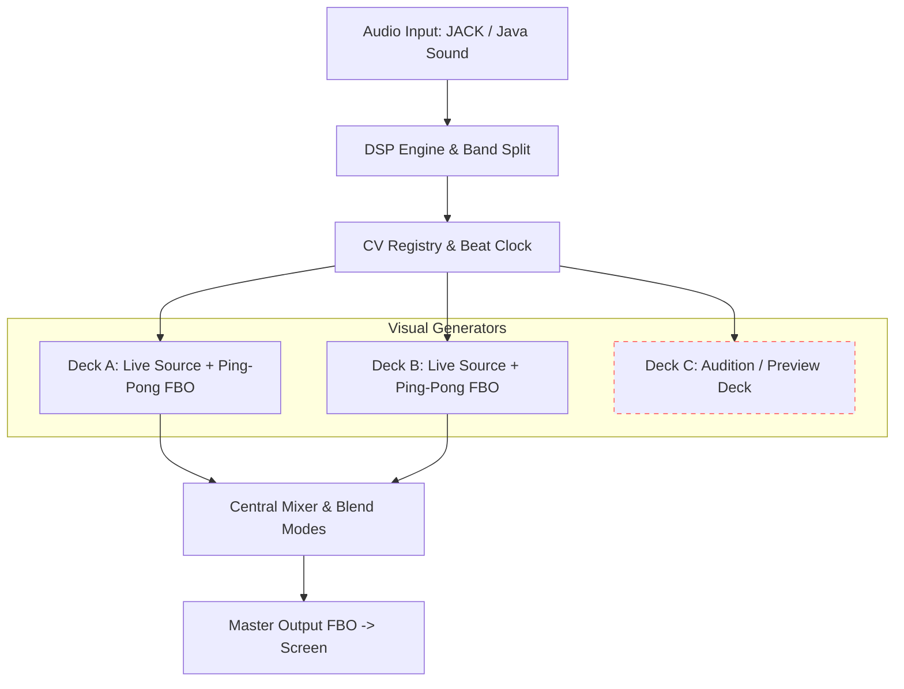

# Core Concepts & Visual Architecture

Liquid LSD is structured around modular visual sources, a multi-deck rendering engine, ping-pong feedback loops, and a central visual mixer.

---

## High-Level Rendering Architecture

---

## Visual Generators (Visual Sources)

Every deck runs a pluggable **Visual Source** that generates procedural geometry or raymarched shaders. Liquid LSD includes 10 built-in engines along with support for dynamic GLSL shaders.

### 1. Mandala Synthesis Engine (`Mandala.kt`)
The core procedural geometry generator:
- **Lobe Count (Petals)**: Controls rotational symmetry (how many repeating arms are generated).
- **Mandala Ratios**: Accesses a curated library of ~300 ratio presets determining mathematical harmonic intersections.
- **3D Projections**:
  - *Spherical Mapping*: Extrudes 2D curves onto a 3D sphere via longitude/latitude angles.
  - *Polyhedral Reflections*: Replicates curves across Cubic/Octahedral (8 instances) or Tetrahedral (4 instances) reflection groups.
  - *Coordinate Permutation*: Projects curves onto XY, YZ, and ZX planes simultaneously.
  - *Perspective View*: Seamlessly transition from orthographic (`3D Persp` = 0) to immersive perspective projection (`3D Persp` = 1).

### 2. Procedural & Raymarched Shader Sources
Built-in procedural visual generators:
- **Attractor Feedback**: Strange attractor log-density inverse mapping with feedback trail accumulation.
- **Dynamic Spiral**: Multi-point spiral curve generator with radial range culling.
- **Gyroid**: Dynamic 3D triply periodic minimal surface raymarcher.
- **Chladni**: Acoustic 2D/3D vibration pattern generator.
- **Icosa-Dodeca**: Continuous $H_3$ Coxeter polyhedral morph and Kepler-Poinsot stellation raymarcher with translucent crystal reveal.

#### Icosa-Dodeca Quick Reference & Classic Solids
The **Icosa-Dodeca** engine morphs through regular Platonic solids, Archimedean bridges, and Kepler-Poinsot star polyhedra:

* **`Morph` ($0.0 \to 1.0$)**: Primary 4-phase cyclic timeline sweeping across canonical shapes:
  * `0.00`: **Icosahedron** (20 triangular faces)
  * `0.125`: **Icosidodecahedron** (32 faces: 20 triangles + 12 pentagons)
  * `0.25`: **Dodecahedron** (12 pentagonal faces)
  * `0.50`: **Great Stellated Dodecahedron** (12 5-pointed star pyramids)
  * `0.75`: **Great Icosahedron** (20 3-sided star spikes)
  * `1.00`: Loops back smoothly to Icosahedron.
* **`Stellation` ($0.0 \to 1.0$)**: Direct star spike height boost. Set `Morph = 0.0` or `0.25` and dial `Stellation` to grow star spikes manually.
* **`Support H` ($-1.0 \to 1.0$)**: Plane distance from center. Lowering to `-0.15` produces truncated forms (e.g. Buckyball / Soccer Ball).
* **`Opacity` ($0.0 \to 1.0$)**: Face transparency. Sweet spot is `0.6–0.8` for "Crystal Reveal" to see inner intersecting geometric facets.

| Solid Name | Morph | Stellation | Support H | Description |
| :--- | :---: | :---: | :---: | :--- |
| **Icosahedron** | `0.00` | `0.00` | `0.00` | 20 equilateral triangular faces. |
| **Icosidodecahedron** | `0.125` | `0.00` | `0.00` | Archimedean duality bridge (triangles + pentagons). |
| **Dodecahedron** | `0.25` | `0.00` | `0.00` | 12 regular pentagonal faces. |
| **Great Stellated Dodecahedron** | `0.50` | `0.00` | `0.00` | 12 sharp 5-fold star spikes. |
| **Great Icosahedron** | `0.75` | `0.00` | `0.00` | 20 sharp 3-fold star spikes. |
| **Truncated Icosahedron (Buckyball)** | `0.00` | `0.00` | `-0.15` | Classic soccer ball (pentagons & hexagons). |

---

## Framebuffer Feedback Loops (Ping-Pong FBOs)

Each deck incorporates an independent dual Framebuffer Object (FBO) feedback loop:
1. The raw visual source renders into `cleanFBO`.
2. The previous frame's feedback texture is combined with `cleanFBO` inside `feedback.frag`.
3. Feedback transformation uniforms (**Decay**, **Gain**, **Zoom**, **Rotate**, **Hue Shift**, **Blur**, **Chroma Offset**) shift and decay the image continuously.
4. Read and write feedback buffers swap (ping-pong) each frame, creating fluid liquid trails, organic motion, and video-feedback zoom effects.

---

## Deck Architecture: Live Decks A/B vs. Preview Deck C

Liquid LSD features a three-deck architecture tailored for live VJ performance:

### Deck A & Deck B (Live Performance Decks)
Decks A and B drive the live master output. They feed directly into the central Mixer.

### Deck C (Preview / Audition Deck)
Deck C runs the complete rendering pipeline (Visual Source + Ping-Pong Feedback), but is **strictly excluded from the Mixer master output**. 
- **Auditioning Patches**: Performers can load, build, edit, and preview new patches on Deck C while Decks A and B continue delivering live visuals to the audience screen.
- **Safe Preparation**: Test complex CV routings or shader parameters safely on Deck C before loading them onto live Decks A or B.

---

## Central Mixer & Blending Modes

The central Mixer blends the outputs of Deck A and Deck B to form the master video signal.

### Blending Equations
- **`ADD`** (Additive): Sums RGB values; ideal for dark background contrast.
- **`SCREEN`**: Lightens overlapping areas while preserving dark detail.
- **`MULT`** (Multiply): Multiplies RGB values; creates subtractive stencil masks.
- **`MAX`** (Lighten): Compares A and B per-pixel and selects the brightest color.
- **`XFADE`** (Crossfade): Standard linear interpolation between Deck A and Deck B.

### Crossfader Modulation & Manual Takeover
The `crossfade` slider interpolates between Deck A (-1.0) and Deck B (1.0). Like all parameters in Liquid LSD, `crossfade` can be modulated by CV sources (e.g. an LFO or `audio_bass`) to automate deck switching in tight sync with the music.

- **Manual Takeover**: If the user moves the crossfader slider using the mouse or a mapped MIDI controller:
  - **Auto-VJ Disarms**: Auto-VJ is immediately turned off (`AUTO-VJ` checkbox unchecks) and any active automated crossfade transition is stopped.
  - **CV Modulators Mute**: All non-MIDI CV modulators assigned to `Mixer/crossfade` are automatically muted (`bypassed = true`), giving the performer clean 1:1 manual authority over deck blending without fighting background modulation.
  - **MIDI Controllers Remain Active**: Modulators mapped to physical MIDI CCs are preserved and remain active.
- **Auto-Centering on CV Unmute**: When the user un-mutes any CV modulator on the crossfader in the modulation matrix or cell inspector, `crossfade.baseValue` automatically snaps to `0.0` (unbiased center). This ensures that LFOs or audio followers immediately resume full-range, symmetrical oscillation between Deck A and Deck B without clipping against previous manual hold positions. Modulator `DC Offset` can be used whenever an intentional deck bias is desired.

### Momentary Controls & Triggers (Prev/Next, Rand A/B/C/All)
Located directly beneath the Crossfader in the Master Mixer panel, a row of 6 momentary buttons provides direct access to queue navigation and randomization:
- **`< Prev` / `Next >`**: Steps backward or forward through the active playlist queue (`Mixer/queuePrev`, `Mixer/queueNext`).
- **`Rand A` / `Rand B` / `Rand C`**: Re-rolls all randomizable modulators and base values for the selected deck (`Mixer/randDeckA`, `Mixer/randDeckB`, `Mixer/randDeckC`).
- **`Rand All`**: Re-rolls modulators and randomizable values across Deck A, Deck B, Deck C, and Master parameters simultaneously (`Mixer/randAll`).

**Simultaneous Triggers without Takeover**: Unlike continuous fader positions that hold a continuous value, momentary triggers are discrete pulses (rising-edge events). Using the mouse buttons, hardware MIDI triggers, or clock/LFO CV gates executes the discrete action immediately without muting modulators or disarming background automation.

---

## Render Resolution & Video Output Scaling

Liquid LSD provides granular control over internal render resolution and external display output scaling under **Settings -> Video & Display**:

### 1. Resolution Presets & Custom Dimensions
- **16:9 Presets**: 1080p ($1920 \times 1080$), 720p ($1280 \times 720$), 540p ($960 \times 540$), 1440p ($2560 \times 1440$), 4K UHD ($3840 \times 2160$).
- **4:3 Presets**: UXGA ($1600 \times 1200$), XGA ($1024 \times 768$), SVGA ($800 \times 600$) for club projectors and vintage CRT displays.
- **1:1 Square Presets**: $1080 \times 1080$, $800 \times 800$, $600 \times 600$ for modular stage LED walls and livestreams.
- **Custom**: User-specified width and height (from $128 \times 128$ to $7680 \times 4320$).

### 2. GPU Performance Scaling
Running complex shaders across three decks simultaneously evaluates millions of pixels per frame. Switching from 1080p to 720p or 540p reduces GPU load by 55%–75%, allowing smooth 60 FPS performance on laptops and integrated GPUs.

### 3. Display Scaling Modes
When the internal render aspect ratio differs from the connected display or secondary projector:
- **Fit (Letterbox / Pillarbox)**: Maintains exact render aspect ratio with black border bars.
- **Fill (Crop)**: Centers and crops edges to completely fill the screen without borders.
- **Stretch**: Stretches the image to fill the output screen.

---

## UI Display Modes & Global Shortcuts

- **Background Video (`B`)**: Toggles rendering the master video output directly behind the semi-transparent ImGui interface. Can also be toggled via **Settings -> Video & Display -> Background Video**.
- **Clean Mode (`F`)**: Toggles clean fullscreen view, hiding the entire user interface to view pure master video output without distractions.
- **Global Font Scaling (`Ctrl-` / `Ctrl=`)**: Zooms and scales the entire interface typography and widget layouts dynamically.

